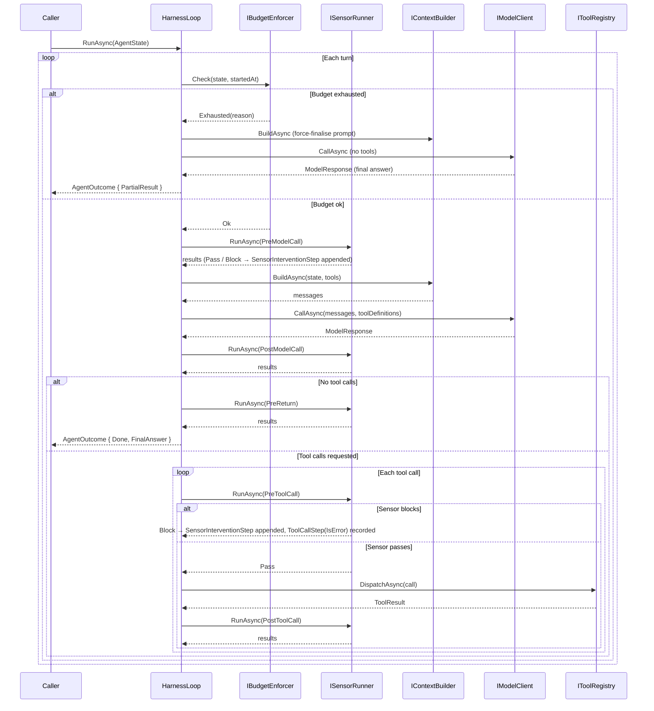

# agent-harness

A reusable agent harness framework for .NET 10, structured around Clean / Onion
architecture. This walking skeleton runs end-to-end against a scripted
`FakeModelClient` so you can see the shape of the framework without any API
keys.

## Run it

```bash
dotnet run --project src/AgentHarness.SampleAgent
```

You should see JSON trace events stream to stdout, followed by the final
outcome and a flattened trajectory.

## Architecture

Three projects with a strict dependency direction:

```
┌─────────────────────────┐     ┌──────────────────────────────┐     ┌──────────────────────────┐
│   AgentHarness.Sample   │────▶│  AgentHarness.Infrastructure  │────▶│  AgentHarness.Framework  │
│         Agent           │     │                              │     │                          │
│  (composition root, DI) │────────────────────────────────────────▶│  (abstractions + loop)   │
└─────────────────────────┘     └──────────────────────────────┘     └──────────────────────────┘
```

- **`AgentHarness.Framework`** — pure abstractions, the core loop, and a thin
  set of `IServiceCollection` extension methods so consumers can compose the
  defaults via `services.AddAgentHarness(systemPrompt)`. Only external
  dependency is `Microsoft.Extensions.DependencyInjection.Abstractions`.
  Reusable across any agent, any model, any transport.
- **`AgentHarness.Infrastructure`** — concrete adapters that implement the
  framework's interfaces: `FakeModelClient`, `PollyResilientModelClient`,
  `ConsoleTracer`, `InMemoryToolRegistry`, plus sample `EchoTool` and
  `CalculatorTool`. Depends on Framework + Polly v8.
- **`AgentHarness.SampleAgent`** — a console app showing how a consumer wires
  the framework into a domain agent via `Microsoft.Extensions.DependencyInjection`.

### The loop (`HarnessLoop`)



Per turn:

1. **Budget enforcement.** `IBudgetEnforcer` returns `Ok` or `Exhausted(reason)`.
   No exceptions for normal flow — exhaustion triggers a single
   *finalisation* turn (tools disabled, system note injected) that returns
   `AgentOutcome { Status = PartialResult }`.
2. **`PreModelCall` sensors** run in parallel via `ISensorRunner`.
3. **Model call** produces a `ModelResponse` and a `ModelCallStep` is appended.
4. **`PostModelCall` sensors** run.
5. If the response has **no tool calls**, sensors fire at `PreReturn` and the
   loop returns `Done` with the model's text as `FinalAnswer`.
6. Otherwise, for each requested tool call: `PreToolCall` sensors → dispatch
   via `IToolRegistry` → `PostToolCall` sensors.

`BudgetExceededException` exists but is reserved for collaborators (tools,
sub-agents) that breach budget from underneath the loop — actual unexpected
conditions, not control flow.

### Guides (perception shaping)

Guides shape what the model perceives on each turn. They run sequentially in
registration order before every model call, each contributing to a shared
`ContextDraft`. `DefaultContextBuilder` assembles the draft into a prompt.

The guide/sensor split is intentional:

| Concept | Role |
|---|---|
| **Guides** | Shape perception — what tools are visible, what history is shown, what memory is surfaced |
| **Sensors** | Observe and intervene — can block transitions and inject `SensorInterventionStep` records |

Sensor intervention records feed *back through* the guide pipeline (specifically
`TrajectoryGuide`) so their rendering into the next prompt is also a guide
concern — the loop stays clean.

Four built-in guides are registered by `AddAgentHarness`:

| Guide | Responsibility |
|---|---|
| `SystemPromptGuide` | Sets `ContextDraft.SystemPrompt` |
| `TrajectoryGuide` | Renders trajectory steps (model turns, tool results, sensor notes) into `ContextDraft.TrajectoryMessages` |
| `MemoryGuide` | No-op; replace to surface long-term memory into `ContextDraft.MemorySnippets` |
| `ToolSelectorGuide` | No-op passthrough; replace to filter/rank `ContextDraft.AvailableTools` |

To add a custom guide:

```csharp
public sealed class MyRankingGuide : IGuide
{
    public string Name => "my-ranking-guide";

    public Task ContributeAsync(ContextDraft draft, AgentState state, CancellationToken ct)
    {
        // filter draft.AvailableTools, append to draft.MemorySnippets, etc.
        return Task.CompletedTask;
    }
}

// registration — runs after the built-in guides
services.AddGuide<MyRankingGuide>();
```

### Sensor blocks

A sensor block at any hookpoint appends a `SensorInterventionStep` to the
trajectory. `DefaultContextBuilder` is responsible for rendering these into
the next prompt (currently as system-role notes: *"sensor X at hookpoint Y:
reason — adjust your plan accordingly"*). The model gets to re-plan rather
than the loop terminating. Sensor history stays out of tool-call history.

At `PreToolCall`, a block additionally short-circuits the dispatch and a
synthetic `ToolCallStep` records the blocked attempt with `IsError = true`.

### State

`AgentState` is an immutable record. Every turn produces a new state via
`with`-expressions; the `Trajectory` is the durable, append-only log of state
transitions. This makes checkpointing trivial to add later — the records are
plain enough that any serialiser can handle them.

`ModelCallStep` carries `Usage` and `Cost` so budget enforcement can sum
directly across the trajectory without re-deriving anything.

## Extending the framework

### Add a new tool

1. Implement `ITool` in `AgentHarness.Infrastructure/Tools/` (or your own
   project). Provide a `JsonElement` `InputSchema` so the model client can
   forward it to the provider's tool-def format.
2. Register it in your `Program.cs`:
   ```csharp
   services.AddSingleton<ITool, MyTool>();
   ```

### Add a new sensor

1. Implement `ISensor`. Declare the `HookPoints` it observes.
2. Register it:
   ```csharp
   services.AddSingleton<ISensor, MySensor>();
   ```
   `DefaultSensorRunner` will pick it up automatically and run it in parallel
   with the other sensors registered at the same hookpoint.

### Swap the model client

The Framework only knows `IModelClient.CallAsync(messages, toolDefinitions, ct)`.
It never sees `ITool`. To add a real provider (Anthropic SDK, Azure OpenAI,
etc.):

1. Implement `IModelClient` in a new adapter class. Translate
   `ToolDefinition.InputSchema` (a `JsonElement`) into the provider's tool
   schema format.
2. Replace the registration:
   ```csharp
   services.AddSingleton<IModelClient>(_ => new PollyResilientModelClient(
       new MyProviderModelClient(apiKey)));
   ```

The `PollyResilientModelClient` decorator is reusable — wrap any inner
`IModelClient` to get retry + circuit-breaker.

### Composition pattern

Two patterns per single-instance abstraction:

- `AddXxx<TImpl>()` / `AddXxx(factory)` — explicit override; uses `Replace`.
- `AddXxxDefault()` — registers the framework's default via `TryAdd`, so any
  prior explicit registration wins regardless of call order.

Guides are a collection, not a single registration, so the pattern differs:
`AddXxxGuideDefault()` unconditionally adds the built-in guide; opt-out is
simply not calling it. `AddGuide<T>()` appends a consumer-defined guide that
runs after the built-in ones.

`AddAgentHarness(systemPrompt)` aggregates everything. Consumers still need to
register `IModelClient`, `IToolRegistry`, `ITracer`, and any `ITool` / `ISensor`
instances — the framework can't choose those.

Typical wireup:

```csharp
services
    .AddAgentHarness(systemPrompt)
    .AddTracer<ConsoleTracer>()
    .AddToolRegistry<InMemoryToolRegistry>()
    .AddModelClient(_ => new PollyResilientModelClient(new MyModelClient()));

services.AddSingleton<ITool, MyTool>();
services.AddSingleton<ISensor, MySensor>();
services.AddGuide<MyCustomGuide>();   // optional — runs after built-in guides
```

## What's deliberately out of scope (and where the seams are)

| Future capability        | Seam to extend                                              |
| ------------------------ | ----------------------------------------------------------- |
| Real model providers     | `IModelClient`                                              |
| Sub-agents / A2A         | `ITool` (a sub-agent is just another tool)                  |
| MCP integration          | `ITool` (an MCP tool implements the same interface)         |
| Long-term memory         | `MemoryGuide` — implement `IGuide`, populate `MemorySnippets` |
| Token-aware compaction   | `TrajectoryGuide` — replace with a compacting implementation |
| Tool relevance ranking   | `ToolSelectorGuide` — replace to filter `AvailableTools`    |
| Checkpoint / persistence | `AgentState` is plain-serialisable; no impl yet             |

A `JsonSerializerContext` for source-gen JSON is deliberately *not* in the
Framework — nothing in the skeleton serialises state. When checkpointing
lands, the context belongs alongside whoever's writing the bytes, and we'll
spike `[JsonPolymorphic]` source-gen support for the `Step` hierarchy at that
point.
