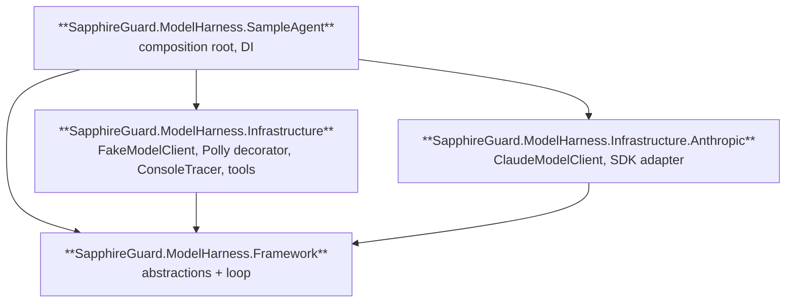
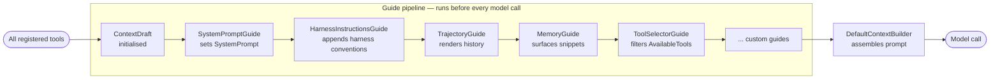
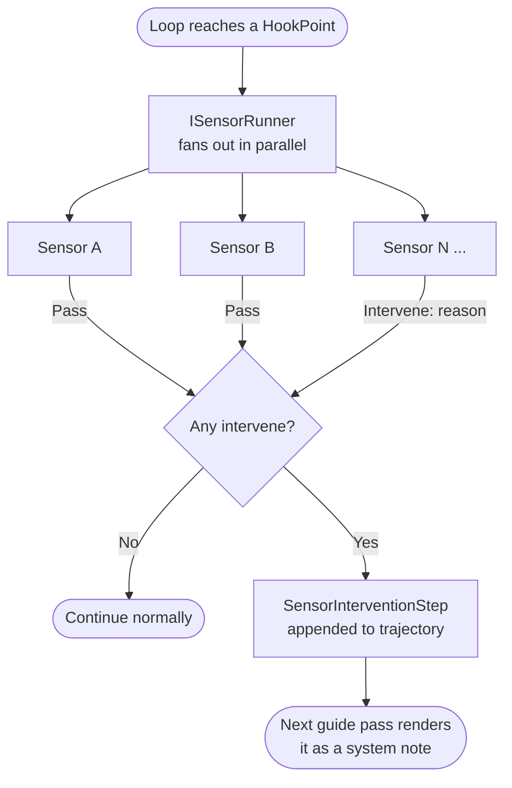
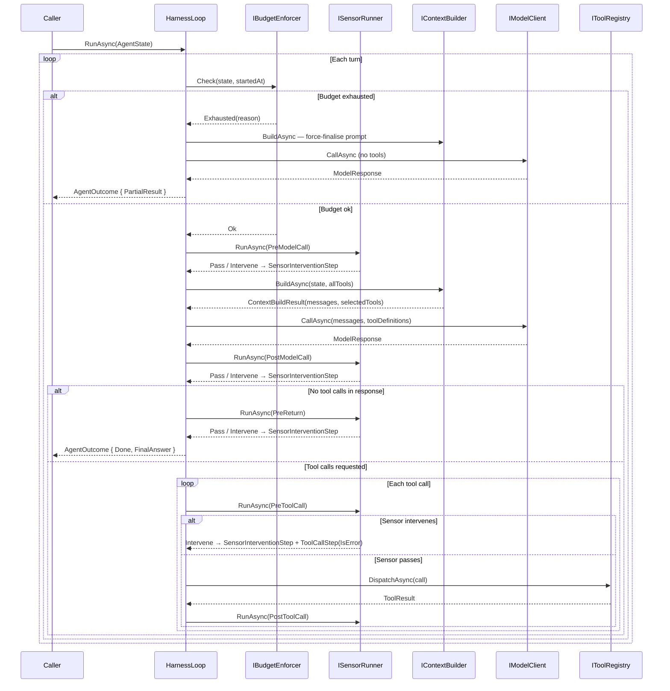

# model-harness

A reusable model harness framework for .NET 10, structured around Clean / Onion
architecture.

> **Why "model harness"?** An *agent* is a model plus a harness — the harness
> is the scaffolding (loop, guides, sensors, budget) that wraps a model and
> turns it into an agent. Calling it an "agent harness" would imply the harness
> *is* the agent; "model harness" names what it actually is.

The `SampleAgent` wires up `ClaudeModelClient` against the real Anthropic API.
A `FakeModelClient` is also provided for local development without an API key.

## Run it

Add your Anthropic API key to `src/SapphireGuard.ModelHarness.SampleAgent/appsettings.local.json`:

```json
{
  "Anthropic": {
    "ApiKey": "sk-ant-..."
  }
}
```

Then run:

```bash
dotnet run --project src/SapphireGuard.ModelHarness.SampleAgent
```

JSON trace events stream to stdout, followed by the final outcome and a
flattened trajectory.

---

## Architecture

Four projects with a strict dependency direction:



- **`SapphireGuard.ModelHarness.Framework`** — abstractions, the core loop, five built-in
  guides, and `IServiceCollection` extension methods. Only external dependency
  is `Microsoft.Extensions.DependencyInjection.Abstractions`.
- **`SapphireGuard.ModelHarness.Infrastructure`** — concrete adapters: `FakeModelClient`,
  `PollyResilientModelClient`, `ConsoleTracer`, `InMemoryToolRegistry`,
  `EchoTool`, `CalculatorTool`. Production sensors: `PiiRedactionSensor` (PostModelCall,
  scans for email/phone/card/NI/SSN patterns), `CostThrottleSensor` (PreModelCall, soft
  spend cap), `ToolResultSanityCheckSensor` (PostToolCall, validates result shape and
  custom per-tool rules). Depends on Framework + Polly v8.
- **`SapphireGuard.ModelHarness.Infrastructure.Anthropic`** — Anthropic SDK adapter:
  `ClaudeModelClient` maps framework messages and tool definitions to the
  Anthropic Messages API and back. Depends on Framework only.
- **`SapphireGuard.ModelHarness.SampleAgent`** — console app showing how a domain agent wires
  the framework via `Microsoft.Extensions.DependencyInjection`.

---

## Core patterns

The framework is built around two composable patterns that together give
fine-grained control over agent behaviour without modifying the loop.

### The Guide pattern — shaping perception

A **Guide** controls what the model sees on each turn. Before every model call,
all registered guides run in order, each contributing to a shared `ContextDraft`.
`DefaultContextBuilder` then assembles the draft into the final prompt.



Each guide receives the full `ContextDraft` and the current `AgentState`, and
writes into one or more of the draft's fields:

| Field | Purpose |
|---|---|
| `SystemPrompt` | Agent identity and standing instructions |
| `TrajectoryMessages` | Rendered history — model turns, tool results, sensor notes |
| `MemorySnippets` | Long-term knowledge surfaced from a retrieval system |
| `AvailableTools` | Tool list for this turn — guides can filter or reorder |

Implement `IGuide` to create a custom guide:

```csharp
public sealed class MyGuide : IGuide
{
    public string Name => "my-guide";

    public Task ContributeAsync(ContextDraft draft, AgentState state, CancellationToken ct)
    {
        // e.g. filter tools based on the current turn count
        if (state.Trajectory.Count > 4)
            draft.AvailableTools.RemoveAll(t => t.Name == "search");

        return Task.CompletedTask;
    }
}

services.AddGuide<MyGuide>(); // runs after the five built-in guides
```

Guides run **sequentially** so each one can build on what the previous added —
a tool-selector guide can, for example, inspect memory snippets before deciding
which tools to expose.

### The Sensor pattern — observing and intervening

A **Sensor** observes the loop at declared hookpoints and can raise a concern
by returning `SensorResult.Intervene(reason)`. The loop's response to that concern
depends on the hookpoint — sensors do not control flow directly. Sensors run in
**parallel** at each hookpoint — they observe independently and do not share state.



The five hookpoints, their typical use, and what the loop does when a sensor intervenes:

| HookPoint | Fires | Typical use | On intervention |
|---|---|---|---|
| `PreModelCall` | Before building context and calling the model | Rate limiting, cost throttling | **The loop force-finalises** — it makes one model call with tools disabled so the model can answer from what it already knows, then returns `Done`. The loop cannot loop back here: no model call has happened yet, so the trajectory is unchanged from the previous turn — looping would be infinite. |
| `PostModelCall` | After the model responds, before acting on it | PII detection, output filtering | **Loops back** — the model gets another turn. Crucially, the flagged response text is **suppressed from the next context**: `TrajectoryGuide` omits it so the model cannot re-see flagged content. The intervention note still appears so the model knows why it was flagged. |
| `PreToolCall` | Before each tool is dispatched | Policy enforcement, authorisation | **Tool is never dispatched** — a `ToolCallStep` with `IsError = true` is recorded so the model sees a clean error result and can replan. |
| `PostToolCall` | After each tool result is received | Result validation, audit logging | **Advisory only** — the tool has already run and its result is already in the trajectory. The intervention is recorded as a system note; the model can still reason on the result. Use `PreToolCall` if you need to prevent execution. |
| `PreReturn` | Before returning a final answer to the caller | Answer quality checks | **Loops back** — the model retries. Unlike PostModelCall, the prior answer *is* visible in context so the model can see what it said and correct it. |

An intervention does not terminate the run. The sensor's reason is wrapped in a
`SensorInterventionStep` and appended to the trajectory. On the next turn,
`TrajectoryGuide` renders it as a system-role note prefixed `[HARNESS OBSERVATION — ...]`.
`HarnessInstructionsGuide` tells the model upfront (in the system prompt) what these
notes mean and that they must be treated as directives — this is the feedforward complement
to the sensor's feedback. Intervention records are separate from tool-call history so
tool history stays clean.

Implement `ISensor` to create a custom sensor:

```csharp
public sealed class MySensor : ISensor
{
    public string Name => "my-sensor";
    public IReadOnlySet<HookPoint> HookPoints { get; } =
        new HashSet<HookPoint> { HookPoint.PreToolCall };

    public Task<SensorResult> CheckAsync(
        HookPoint hookPoint, AgentState state, Step? triggeringStep, CancellationToken ct)
    {
        if (triggeringStep is ToolCallStep tc && tc.Call.ToolName == "dangerous-tool")
            return Task.FromResult(SensorResult.Intervene("dangerous-tool is not permitted."));

        return Task.FromResult(SensorResult.Pass);
    }
}

services.AddSingleton<ISensor, MySensor>();
```

### How guides and sensors work together

Sensors intervene; guides determine what the model learns from that intervention.
The loop itself stays unaware of either pattern's semantics — it just runs the
runners and records the steps.

```
Sensor intervenes at PreToolCall
        │
        ▼
SensorInterventionStep appended to AgentState.Trajectory
        │
        ▼  (next turn)
TrajectoryGuide renders it as a system-role note in ContextDraft
        │
        ▼
Model sees: "[HARNESS OBSERVATION — my-sensor at PreToolCall] dangerous-tool is not permitted — adjust your next action and do not repeat flagged behaviour."
        │
        ▼
Model re-plans without that tool
```

---

## The loop (`HarnessLoop`)



Budget exhaustion is not an exception — `IBudgetEnforcer.Check` returns
`Exhausted(reason)` and the loop makes one final model call with tools disabled,
returning `AgentOutcome { Status = PartialResult }`. `BudgetExceededException`
is reserved for tools or sub-agents that violate budget from underneath the loop.

---

## Extending the framework

### Add a tool

```csharp
public sealed class MyTool : ITool
{
    public string Name => "my-tool";
    public string Description => "Does something useful.";
    public JsonElement InputSchema => JsonDocument.Parse("""{ "type": "object" }""").RootElement;

    public Task<ToolResult> ExecuteAsync(ToolCall call, ToolContext ctx, CancellationToken ct)
        => Task.FromResult(new ToolResult(call.CallId, "result"));
}

services.AddSingleton<ITool, MyTool>();
```

### Add a sensor

```csharp
services.AddSingleton<ISensor, MySensor>();
```

`DefaultSensorRunner` picks it up automatically and runs it in parallel with
other sensors registered at the same hookpoint.

### Add a guide

```csharp
services.AddGuide<MyGuide>(); // runs after the five built-in guides
```

### Swap the model client

`IModelClient` only sees `ToolDefinition` records — it never touches `ITool`.
Implement it, translate `ToolDefinition.InputSchema` (`JsonElement`) into your
provider's tool-def format, and replace the registration:

```csharp
services.AddModelClient(_ => new PollyResilientModelClient(new MyProviderClient(apiKey)));
```

### Resilience — the decorator pattern

`PollyResilientModelClient` wraps any `IModelClient` and adds retry and
circuit-breaking without the wrapped client knowing anything about it. This is
the **decorator pattern**: a class that implements an interface by delegating to
another implementation of the same interface, adding behaviour around it.

```
PollyResilientModelClient   ← adds retry + circuit breaker
        │
        └─▶ ClaudeModelClient       ← does the actual Anthropic API call
                 (or FakeModelClient, or any other IModelClient)
```

Because resilience lives in the decorator rather than in `ClaudeModelClient`
itself, it applies automatically to any provider — swap the inner client and
you get the same retry behaviour for free. It also keeps each class focused on
one job: `ClaudeModelClient` handles the Anthropic API, `PollyResilientModelClient`
handles failure.

The two behaviours it adds:

- **Retry** — on a network error or timeout, waits 200 ms then tries again,
  doubling the wait each time, up to 3 retries.
- **Circuit breaker** — if more than 50% of recent calls fail, stops trying
  immediately for 15 seconds rather than hammering a broken endpoint. Lets one
  call through after the break to check if the service has recovered.

### Composition pattern

Two patterns per **single-instance** abstraction:

- `AddXxx<TImpl>()` / `AddXxx(factory)` — explicit override, uses `Replace`.
- `AddXxxDefault()` — framework default via `TryAdd`; any prior explicit registration wins.

**Guides are a collection**, so the pattern differs: `AddXxxGuideDefault()` uses plain
`AddSingleton` (not `TryAdd`). Opt-out by not calling the default. Custom guides
append with `AddGuide<T>()`.

`AddModelHarness(systemPrompt)` aggregates everything. You still need to register
`IModelClient`, `IToolRegistry`, `ITracer`, and your `ITool` / `ISensor` instances.

```csharp
services
    .AddModelHarness(systemPrompt)
    .AddTracer<ConsoleTracer>()
    .AddToolRegistry<InMemoryToolRegistry>()
    .AddModelClient(_ => new PollyResilientModelClient(new MyModelClient()));

services.AddSingleton<ITool, MyTool>();
services.AddSingleton<ISensor, MySensor>();
services.AddGuide<MyCustomGuide>(); // optional
```

---

## Roadmap

See [ROADMAP.md](ROADMAP.md) for what's done and what's still to implement.

---

## What's deliberately out of scope (and where the seams are)

| Future capability        | Seam to extend                                                |
| ------------------------ | ------------------------------------------------------------- |
| Real model providers     | `IModelClient`                                                |
| Sub-agents / A2A         | `ITool` (a sub-agent is a tool that calls another `HarnessLoop`) |
| MCP integration          | `ITool` (an MCP tool is a tool)                               |
| Long-term memory         | `MemoryGuide` — populate `ContextDraft.MemorySnippets`        |
| Token-aware compaction   | `TrajectoryGuide` — replace with a windowing implementation   |
| Tool relevance ranking   | `ToolSelectorGuide` — filter `ContextDraft.AvailableTools`    |
| Checkpoint / persistence | `AgentState` is serialisation-ready; no persistence impl yet  |

A `JsonSerializerContext` is deliberately absent — nothing in the skeleton
serialises state. When checkpointing lands it goes in whichever project owns
persistence, alongside a spike of `[JsonPolymorphic]` source-gen for the `Step`
hierarchy.

---

## Glossary

| Term | Definition                                                                                                                                                                                                 |
|---|------------------------------------------------------------------------------------------------------------------------------------------------------------------------------------------------------------|
| **Agent** | An Agent = Model + Harness. A loop-driven process that takes a natural-language task, uses tools and a model to produce a result, and records every step it takes.                                         |
| **Turn** | One iteration of the loop: build context → call model → act on response. Each turn appends one or more `Step`s to the trajectory.                                                                          |
| **Trajectory** | The append-only, ordered list of `Step`s on `AgentState`. It is the durable log of everything the agent has done and seen.                                                                                 |
| **Step** | An immutable record of a discrete event. Subtypes: `ModelCallStep`, `ToolCallStep`, `SensorInterventionStep`.                                                                                              |
| **ModelCallStep** | Records a prompt sent to the model and the response received, including token usage and cost.                                                                                                              |
| **ToolCallStep** | Records a tool invocation requested by the model and the result returned.                                                                                                                                  |
| **SensorInterventionStep** | Records that a sensor blocked a transition. Rendered as a system note by `TrajectoryGuide`; kept separate from tool-call history.                                                                          |
| **AgentState** | Immutable record of the agent's full state at a point in time. New state is produced each turn via `with`-expressions — the trajectory is the log of those transitions.                                    |
| **AgentOutcome** | The terminal result of a run: final answer, status, and the last `AgentState`.                                                                                                                             |
| **Budget** | Hard limits on a run: `MaxTurns`, `MaxContextTokens`, `MaxCostUsd`, `MaxWallClock`. Checked by `IBudgetEnforcer` at the top of every turn.                                                                 |
| **Guide** | An `IGuide` implementation that shapes what the model perceives. Contributes to `ContextDraft` before each model call. Runs sequentially in registration order.                                            |
| **ContextDraft** | Mutable object populated by the guide pipeline. Fields: `SystemPrompt`, `TrajectoryMessages`, `MemorySnippets`, `AvailableTools`. Assembled into a prompt by `DefaultContextBuilder`.                      |
| **ContextBuildResult** | What `IContextBuilder` returns: the assembled message list and the guide-filtered tool list. Keeping these in sync is why the result type exists.                                                          |
| **Sensor** | An `ISensor` implementation that observes the loop at declared `HookPoint`s and can return `SensorResult.Intervene(reason)` to raise a concern. The loop's response to an intervention depends on the hookpoint — see the hookpoint table. Runs in parallel with peer sensors. |
| **HookPoint** | An enumerated lifecycle position where sensors fire: `PreModelCall`, `PostModelCall`, `PreToolCall`, `PostToolCall`, `PreReturn`.                                                                          |
| **SensorResult** | The outcome of a sensor check: `Pass` (continue) or `Intervene(reason)` (append a `SensorInterventionStep`; the loop's response depends on the hookpoint — see hookpoint table).                             |
| **Tool** | An `ITool` implementation that the model can invoke. The harness never chooses which tool to call — the model requests it by name; `IToolRegistry` dispatches it.                                          |
| **ToolDefinition** | The model-facing projection of a tool: `Name`, `Description`, `InputSchema` (`JsonElement`). The loop projects `ITool → ToolDefinition` before each model call so `IModelClient` never references `ITool`. |
| **IModelClient** | The transport abstraction. Receives a message list and `ToolDefinition`s; returns a `ModelResponse`. Knows nothing about tools, state, or the loop.                                                        |
| **ModelResponse** | What `IModelClient` returns: optional text, zero or more `ToolCall`s, `StopReason`, `Usage`, and `Cost`.                                                                                                   |
| **HarnessLoop** | The core orchestrator. Drives turn-by-turn execution: enforce budget → run sensors → build context → call model → act on response → repeat.                                                                |
| **StuckDetector** | Built-in sensor that fires at `PreToolCall`. Blocks if the same tool is called with identical arguments three or more times consecutively, preventing infinite loops.                                      |
