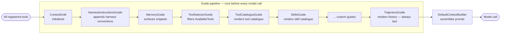
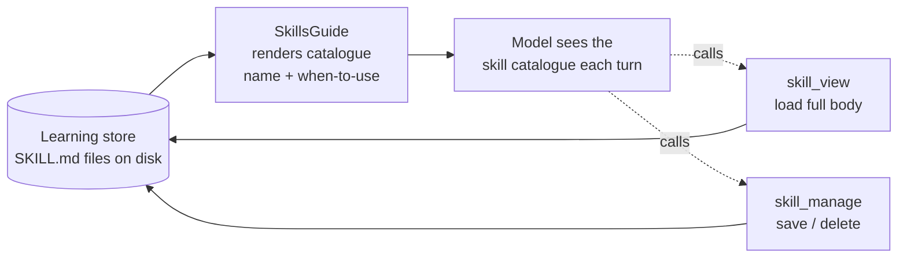
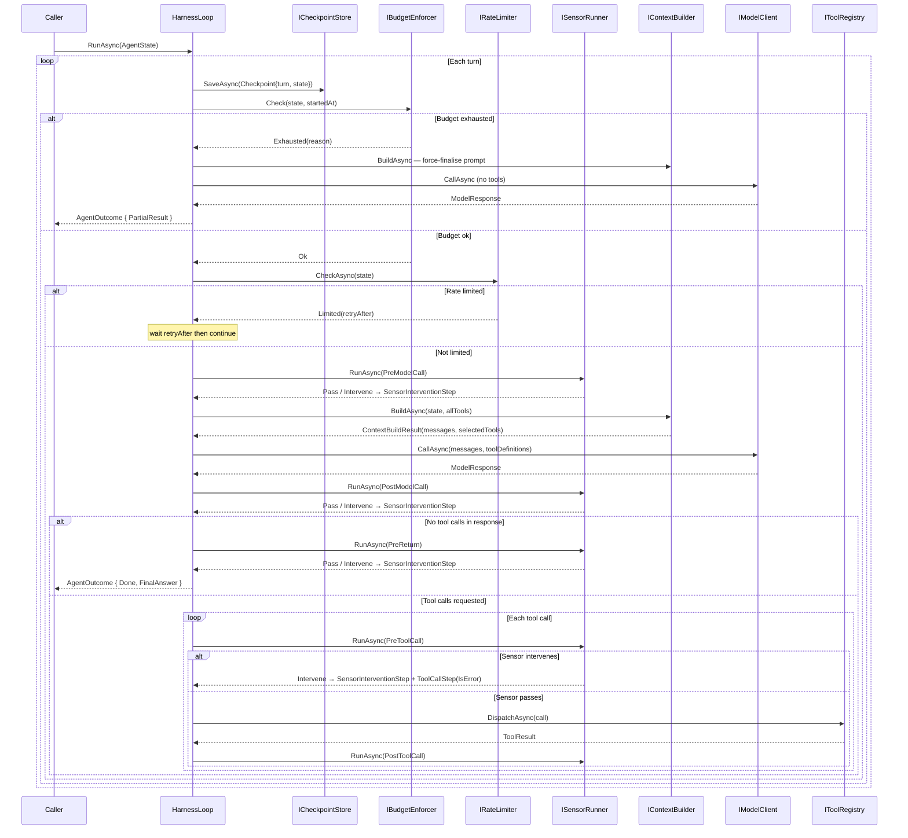
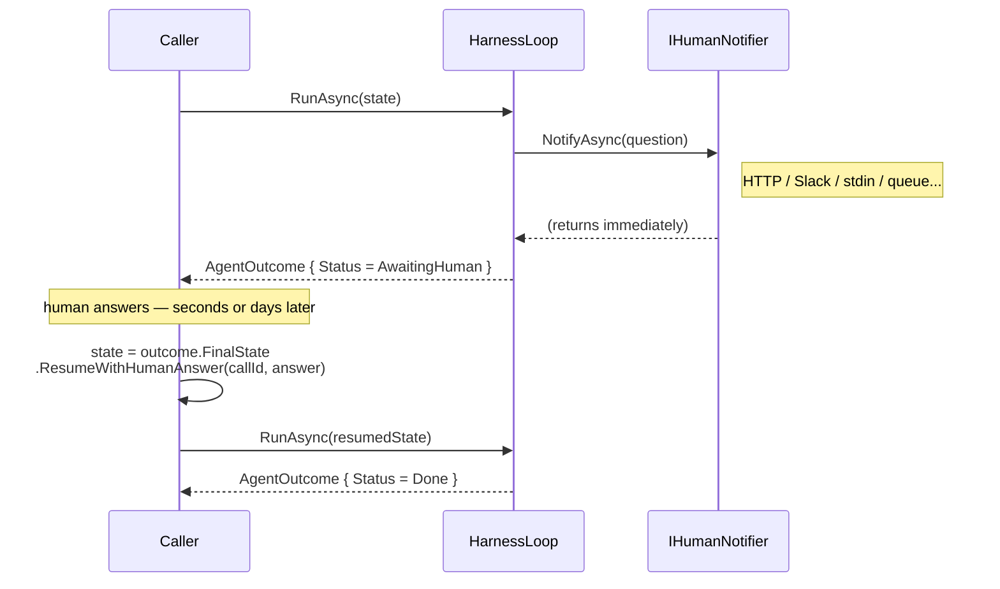

# model-harness

A reusable model harness framework for .NET 10, structured around Clean / Onion
architecture with ports and adapters at every extension point.

> **Why "model harness"?** An *Agent* = Model + Harness. The harness
> is the scaffolding (loop, guides, sensors, budget) that wraps a model and
> turns it into an agent.

## The thesis: do more with less

The prevailing assumption is that better results require a bigger model. This project
tests a different hypothesis: **a well-structured harness can close much of that gap**.

Sensors catch errors and route the model back before they compound. Guides keep context
clean and goal-focused across many turns. Skills give the model reusable procedures so
it does not have to reason from scratch every time. Budget enforcement prevents runaway
costs. Together these let a smaller, cheaper, or locally-hosted model operate with the
kind of reliability that is otherwise assumed to require a frontier model.

The practical ambition: swap `ClaudeModelClient` for `OllamaModelClient` with a
7B-parameter local model and get an *acceptable* result on the same task — not identical,
but good enough for the use case, at a fraction of the cost. Where that bar sits is
always a product decision, not a model decision.

---

## Context engineering

In 2025 "context engineering" emerged as the umbrella term for what this framework is built around. Andrej Karpathy's framing is the clearest: *"the delicate art and science of filling the context window with just the right information for the next step"* — with the analogy that the LLM is the CPU, the context window is RAM, and the context engineer is the OS deciding what to load. Shopify CEO Tobi Lütke puts it plainly: *"the art of providing all the context for the task to be plausibly solvable by the LLM."*

The four standard CE operations — **write, select, compress, isolate** — each have a named home in the harness:

| CE operation | What it means | Where it lives in the harness |
|---|---|---|
| **Write** | Externalise information outside the window for later retrieval | Sensor interventions write `[HARNESS OBSERVATION]` notes into the trajectory; `skill_manage` externalises agent-derived procedures to disk; `ICheckpointStore` externalises full run state |
| **Select** | Pull relevant information into the window when needed | `MemoryGuide` → `IMemoryStore` (replace `NullMemoryStore` with a vector store or knowledge graph); `ToolSelectorGuide` → `IToolSelector`; `SkillsGuide` progressive disclosure — catalogue summary in every prompt, full body loaded on demand via `skill_view`; `HeadEvictionTrajectoryGuide` re-injects `[ORIGINAL GOAL]` every turn so the goal survives compaction |
| **Compress** | Reduce token count while preserving signal | `HeadEvictionTrajectoryGuide` token-aware compaction evicts oldest steps when the estimated token count approaches `MaxContextTokens`; the `ICompactionStrategy` port decides what replaces them — `NullCompactionStrategy` (default) inserts a bare omission note, `AiCompactionStrategy` (opt-in, provider-neutral) calls a lightweight model to produce a prose summary of the evicted segment so the agent retains more signal across long runs; skills use two-tier disclosure (name + when-to-use only, full body on demand) so cost stays low even with many skills |
| **Isolate** | Partition context so sub-agents don't pollute each other | `AgentFactory` gives each named agent a fully isolated `ServiceProvider` — no trajectory, sensors, or state shared between agents; the HITL suspend/resume boundary is a clean context break |

The `ContextDraft` that guides build before each model call is the harness's representation of a context engineering decision. Every field — `SystemPrompt`, `TrajectoryMessages`, `MemorySnippets`, `AvailableTools`, `SystemSections` — is an explicit choice about what the model sees on this turn. Implement `IGuide` to change any of those choices without touching the loop.

> **Known gap:** the select operation for long-term retrieval (`IMemoryStore`) ships as a no-op (`NullMemoryStore`). The port and `MemoryGuide` are the right shape — replace with a vector store or knowledge graph to close this.

The primitives below name the building blocks the harness provides for each of these operations; the core patterns sections show how they are implemented.

---

## Agentic primitives

Every agent, no matter how capable it looks, is an assembly of the same small set of building blocks. Understanding these primitives makes it easier to read this code and reason about where a new concern belongs.

| Primitive | What it is |
|---|---|
| **Tools** | The agent's hands — functions it can call to effect change or read state outside the context window. Tools are the only way an agent can act on the world. |
| **Memory** | What the agent can remember. Four varieties: *in-context* (the current context window), *external / retrieved* (a vector store or knowledge graph queried each turn), *procedural* (named instructions the agent can load and follow), and *in-weights* (fine-tuning — lives outside the harness). The *procedural* variety is implemented here via **Agent Learning** — `SkillsGuide` surfaces saved skills into context each turn, and `skill_manage` / `skill_view` let the model write and read them. |
| **Perception** | What the agent can see right now — the shaped view of world state it reasons over before each model call. Every prompt is an act of perception design. Getting this right matters more than most people expect: what you omit is as important as what you include. Implemented here via the **Guide pattern** — a sequential pipeline of guides that each contribute to a shared context draft before every model call. |
| **Control flow** | The loop that decides what runs next and in what order: call model → act on response → repeat. Budget enforcement, rate limiting, and checkpoint/resume are all control-flow concerns. The loop is deceptively simple; almost all agent reliability problems are really control-flow problems in disguise. |
| **Guardrails** | Checkpoints that intercept and shape agent behaviour at declared points in the loop — before the model call, after it, before a tool runs, after it, before the final answer is accepted. Guardrails observe and redirect; they do not take turns away from the model. Implemented here via the **Sensor pattern** — sensors run in parallel at five hookpoints and feed interventions back through the guide pipeline so the model can self-correct. |
| **Sub-agents** | Agents calling other agents — an orchestrator delegates a sub-task to a specialist, gets a result back, and continues. From the calling agent's perspective a sub-agent is just a tool: it takes a task and returns a result. The isolation contract is what makes this composable — each agent runs in its own container with its own model, sensors, and budget. Implemented here via **`AgentFactory`** and **`AgentTool`** — see the [Multi-agent setup](#multi-agent-setup) section. |

Most agent complexity is a composition of these six — not something fundamentally new. A "research agent" is control flow + tools + memory. An "orchestrated pipeline" adds sub-agents. Building the framework around named primitives keeps the ports obvious: when a new concern arrives, there is usually a clear home for it.

---

The samples under `samples/` wire up `ClaudeModelClient` against the Anthropic API,
`AzureOpenAIModelClient` against Azure AI Foundry / Azure OpenAI Service, and
`OllamaModelClient` against a local Ollama instance. A `FakeModelClient` is also
provided for local development with no external dependencies.

## Run it

Each scenario is its own console project under `samples/`. Add your Anthropic API
key to the `appsettings.local.json` of the sample you want to run, e.g.
`samples/HappyPath/appsettings.local.json`:

```json
{
  "Anthropic": {
    "ApiKey": "sk-ant-..."
  }
}
```

To run the Azure AI Foundry scenario, add your endpoint and deployment name to
`samples/AzureOpenAI/appsettings.local.json`. Omit `ApiKey` to use
`DefaultAzureCredential` (managed identity):

```json
{
  "AzureOpenAI": {
    "Endpoint": "https://your-resource.openai.azure.com",
    "DeploymentName": "gpt-4o",
    "ApiKey": "optional — omit to use DefaultAzureCredential"
  }
}
```

To run the Ollama scenario, add the Ollama model you want to use (the model
must be pulled locally with `ollama pull <model>`) to
`samples/OllamaToolCall/appsettings.local.json`:

```json
{
  "Ollama": { "ModelId": "qwen2.5:7b" }
}
```

Then run any sample by its project path:

```bash
dotnet run --project samples/HappyPath
dotnet run --project samples/AzureOpenAI
dotnet run --project samples/OllamaToolCall
```

JSON trace events stream to stdout, followed by the final outcome and a
flattened trajectory.

---

## Core patterns

The framework is built around two composable patterns that together give
fine-grained control over agent behaviour without modifying the loop.

### The Guide pattern — shaping perception

A **Guide** controls what the model sees on each turn. Before every model call,
all registered guides run in order, each contributing to a shared `ContextDraft`.
`DefaultContextBuilder` then assembles the draft into the final prompt.



Each guide receives the full `ContextDraft` and the current `AgentState`, and
writes into one or more of the draft's fields:

| Field | Purpose |
|---|---|
| `SystemPrompt` | Agent identity and standing instructions |
| `TrajectoryMessages` | Rendered history — model turns, tool results, sensor notes |
| `MemorySnippets` | Long-term knowledge surfaced from a retrieval system |
| `AvailableTools` | Tool list for this turn — guides can filter or reorder |
| `SystemSections` | Pre-rendered system-prompt sections (tool catalogue, skill catalogue) appended after the prompt |

Implement `IGuide` to create a custom guide:

```csharp
public sealed class MyGuide : IGuide
{
    public string Name => "my-guide";

    public Task ContributeAsync(ContextDraft draft, AgentState state, CancellationToken ct)
    {
        // e.g. filter tools based on the current turn count
        if (state.Trajectory.Count > 4)
            draft.AvailableTools.RemoveAll(t => t.Name == "search");

        return Task.CompletedTask;
    }
}
```

Register it in the builder:

```csharp
services.AddModelHarness(builder => builder.WithGuide<MyGuide>());
```

The pipeline order is explicit and fixed. Two ordering constraints drive it:

- **`ToolSelectorGuide` before `ToolCatalogueGuide`** — the catalogue renders whatever tools the selector has approved for this turn; reversing them would always render the full tool list regardless of filtering.
- **`HeadEvictionTrajectoryGuide` last** — it measures the token cost of everything already written to `ContextDraft` (`SystemPrompt`, `MemorySnippets`, `SystemSections`) to compute how much context window remains for the trajectory. Running earlier would mean guessing at that cost with a fixed reserve. This constraint is enforced structurally: `HeadEvictionTrajectoryGuide` implements `ITrajectoryGuide` (not `IGuide`), and `DefaultGuideRunner` resolves it as a separate dependency and always invokes it after all `IGuide` instances — no reliance on DI registration order. Swap the default via `builder.WithTrajectoryGuide<T>()`.

Custom guides registered via `builder.WithGuide<T>()` slot in after the built-ins and before `HeadEvictionTrajectoryGuide`.

`HeadEvictionTrajectoryGuide` implements the [ReAct](https://arxiv.org/abs/2210.03629) pattern: it re-injects the original task text as a `[ORIGINAL GOAL]` system note on every turn so the model cannot drift from its starting intent, even after trajectory compaction drops early history.

### The Sensor pattern — observing and intervening

A **Sensor** observes the loop at declared hookpoints and can raise a concern
by returning `SensorResult.Intervene(reason)`. The loop's response to that concern
depends on the hookpoint — sensors do not control flow directly. Sensors run in
**parallel** at each hookpoint — they observe independently and do not share state.


The five hookpoints, their typical use, and what the loop does when a sensor intervenes:

| HookPoint | Fires | Typical use | On intervention |
|---|---|---|---|
| `PreModelCall` | Before building context and calling the model | Goal-drift warnings, error-streak alerts, conditional pre-reasoning guidance | **Annotates** — the note is appended to the trajectory and the model call proceeds on the same turn so the model can act on it immediately. Rate limiting belongs in `IRateLimiter`; hard cost limits belong in `IBudgetEnforcer`. Neither belongs here. |
| `PostModelCall` | After the model responds, before acting on it | PII detection, output filtering | **Rejects** — the response is suppressed from the trajectory so the model cannot re-see flagged content; the model gets a fresh turn to produce a clean response. |
| `PreToolCall` | Before each tool is dispatched | Policy enforcement, authorisation | **Blocks** — the tool is never dispatched; a `ToolCallStep` with `IsError = true` is recorded so the model sees a clean error and can replan. |
| `PostToolCall` | After each tool result is received | Result validation, audit logging | **Flags** — advisory only; the tool has already run and its result is in the trajectory. The intervention is recorded as an assistant message; the model can still reason on the result. Use `PreToolCall` if you need to prevent execution. |
| `PreReturn` | Before returning a final answer to the caller | Answer quality checks | **Challenges** — the answer is not accepted; the model gets a fresh turn with its prior response visible so it can see what it said and self-correct. |

Sensors may block actions but must never take turns away from the model — the model
always gets the next call so it can self-correct. Each hookpoint has a precise verb:
annotate (`PreModelCall`), reject (`PostModelCall`), block (`PreToolCall`), flag
(`PostToolCall`), challenge (`PreReturn`). An intervention wraps the sensor's reason
in a `SensorInterventionStep` and appends it to the trajectory. On the next turn
(or the same turn for `PreModelCall`), `HeadEvictionTrajectoryGuide` renders it as an assistant-role message
prefixed `[HARNESS OBSERVATION — ...]`. `HarnessInstructionsGuide` tells the model upfront
(in the system prompt) what these notes mean and that they must be treated as directives —
this is the feedforward complement to the sensor's feedback. Intervention records are
separate from tool-call history so tool history stays clean.

Implement `ISensor` to create a custom sensor:

```csharp
public sealed class MySensor : ISensor
{
    public string Name => "my-sensor";
    public IReadOnlySet<HookPoint> HookPoints { get; } =
        new HashSet<HookPoint> { HookPoint.PreToolCall };

    public Task<SensorResult> CheckAsync(
        HookPoint hookPoint, AgentState state, Step? triggeringStep, CancellationToken ct)
    {
        if (triggeringStep is ToolCallStep tc && tc.Call.ToolName == "dangerous-tool")
            return Task.FromResult(SensorResult.Intervene("dangerous-tool is not permitted."));

        return Task.FromResult(SensorResult.Pass);
    }
}
```

Register it in the builder:

```csharp
services.AddModelHarness(builder => builder.WithSensor<MySensor>());
```

### How guides and sensors work together

Sensors intervene; guides determine what the model learns from that intervention.
The loop itself stays unaware of either pattern's semantics — it just runs the
runners and records the steps.

```
Sensor intervenes at PreToolCall
        │
        ▼
SensorInterventionStep appended to AgentState.Trajectory
        │
        ▼  (next turn)
TrajectoryGuide renders it as an assistant-role message in ContextDraft
        │
        ▼
Model sees: "[HARNESS OBSERVATION — my-sensor at PreToolCall] dangerous-tool is not permitted — adjust your next action and do not repeat flagged behaviour."
        │
        ▼
Model re-plans without that tool
```

---

## Budget enforcement

Every run is bounded by a `Budget` — four hard limits checked at the top of each turn
before any sensor or model call:

| Limit | What it controls |
|---|---|
| `MaxTurns` | Maximum number of loop iterations |
| `MaxContextTokens` | Estimated token ceiling for the context window |
| `MaxCost` | Maximum spend (based on the model client's cost tracking) |
| `MaxWallClock` | Maximum elapsed time from the first turn |

Budget exhaustion is **not an exception** — it is control flow. When a limit is hit,
the loop makes one final model call with tools disabled so the model can produce a
best-effort answer from what it already knows, then returns
`AgentOutcome { Status = PartialResult }`. This keeps the agent composable — callers
always get a result, never an unhandled exception from the harness itself.

```csharp
var outcome = await agent.RunAsync(task, budget: new Budget
{
    MaxTurns         = 10,
    MaxContextTokens = 100_000,
    MaxCost          = 0.50m,
    MaxWallClock     = TimeSpan.FromMinutes(2)
});

if (outcome.Status == AgentStatus.PartialResult)
    // The agent hit a limit — outcome.FinalAnswer is its best-effort response.
```

Implement `IBudgetEnforcer` and register via `builder.WithBudgetEnforcer<T>()` to replace
the default policy — useful for dynamic limits, per-user quotas, or cost allocation.

---

## Agent Learning *(Experimental)*

An agent can accumulate knowledge over time by writing its own **skills** — markdown
documents that capture a procedure it worked out, so it can reuse it next time instead
of figuring it out again. Nothing about the model itself changes; the only thing that
changes is what we show it on the next run.

> Anthropic validates this pattern directly: their [Memory tool](https://platform.claude.com/docs/en/agents-and-tools/tool-use/memory-tool)
> lets agents store and retrieve knowledge as plain files between sessions, and their
> [Dreams](https://platform.claude.com/docs/en/managed-agents/dreams) feature consolidates
> those files asynchronously across many transcripts — the cross-episode layer this harness
> deliberately leaves above itself. The boundary between what the harness owns and what
> belongs above it is still worth being deliberate about, but the core pattern is proven.

This reuses the two core patterns: a **guide** surfaces which skills exist, and **tools**
let the model load and save them. The loop has no knowledge of either.



How it works, in one turn:

1. `SkillsGuide` shows the model a short catalogue — just the name and when-to-use
   line for each saved skill (cheap, so it sits in every prompt).
2. If the model wants one, it calls `skill_view` to read the full write-up.
3. When there's something worth keeping, the model calls `skill_manage` to save it.

Each skill is persisted as a `SKILL.md` file (YAML frontmatter + markdown body),
so they survive between runs. Every time the model overwrites a skill, `FileSkillStore`
archives the previous version to `.history/{name}/{timestamp}.md` before writing the new
one — giving operators a full point-in-time record they can inspect or restore via
`ISkillStore.ListVersionsAsync` and `GetVersionAsync`. The model always sees only the
current version; history is an operator safety net, not a model-visible capability.

See `samples/SkillLearning` for a runnable, no-API-key demo: run 1 saves a skill, and
run 2 loads it from disk and reuses it.

### Why it's built this way

The guiding rule: the harness handles **one task** (one "episode"); getting better
over many tasks is a separate job that lives *on top of* the harness, not inside it.
Every choice below keeps that logic out of the framework.

| Decision | Why |
|---|---|
| **Skills are notes, not code** | A skill is just text dropped into the prompt — not a function that gets installed into the running agent. Nothing in the loop has to change, and a bad skill can't break anything. |
| **The model decides to save — the harness just facilitates** | Remember *agent = model + harness*: it's the **model** that chooses to call `skill_manage`, and the harness simply dispatches the call and writes the file. The loop never forces a save or decides one is due. If you later want to automate that (e.g. save after a success), that's a layer you add on top — not something baked into the framework. |
| **Free until used** | The catalogue guide is always wired in, but the default store is empty — so it shows nothing and costs nothing until you opt in. |
| **Show a short list, load on demand** | Every prompt carries only the skill names and when-to-use lines (cheap). The full write-up loads only when the model asks for it, so cost stays low even with lots of skills. |
| **Its own store, separate from memory** | Skills (named, with a body) are a different shape from memory snippets, so they get their own `ISkillStore` and the two can evolve independently. |
| **Version history is an operator concern** | Every overwrite archives the previous `SKILL.md` to a `.history/` subfolder. The model always sees the current version — history is a safety net for the operator (inspect, restore, audit), not something the model reasons about. `ISkillStore` exposes `ListVersionsAsync` / `GetVersionAsync` for programmatic access; `NullSkillStore` and `CompositeSkillStore` get no-op defaults automatically. |

In short: **the harness stores, lists, and hands skills to the model. It never decides
when to save one, or whether the agent is "improving"** — the model makes that call.
Building anything smarter on top (like automatically saving after a success — see the
roadmap) is a layer you add, not part of the framework.

---

## AI-powered sensors *(Experimental)*

Sensors are normally pure, in-process checks — regex, heuristics, rule evaluation. For
some concerns (tone, relevance drift, nuanced policy) a rule-based check is not expressive
enough. An AI-powered sensor addresses this by calling a **separate, lightweight model**
to evaluate the agent's output.

> This is an experimental pattern. Introducing a model call inside a sensor moves away
> from the principle that harness guarantees should be enforceable without depending on
> another model's judgement. Use this only for checks that genuinely cannot be expressed
> as rules, and treat the sensor's verdict as a best-effort signal rather than a hard
> constraint.

The key design points:

- The sensor's model client is **separate from the agent's** — typically a smaller, cheaper
  model (Haiku-class) that is fast enough not to meaningfully affect turn latency.
- The sensor takes `IModelClient` via constructor and is wired via the factory overload of
  `WithSensor` — no framework changes are required.
- Sensors must **fail open**: if the model call throws or returns unparseable output, return
  `SensorResult.Pass` so a transient failure never blocks every agent response.

```csharp
builder.WithSensor(sp => new ToneSensor(
    new ClaudeModelClient(new ClaudeClientOptions
    {
        ApiKey = apiKey,
        ModelId = "claude-haiku-4-5-20251001"   // dedicated sensor model
    })));
```

See `samples/AiToneSensor` for a runnable example: the agent is prompted to respond rudely,
and the tone sensor (Haiku) catches it and forces a professional retry.

---

## The loop (`HarnessLoop`)



Budget exhaustion is not an exception — `IBudgetEnforcer.Check` returns
`Exhausted(reason)` and the loop makes one final model call with tools disabled,
returning `AgentOutcome { Status = PartialResult }`. `BudgetExceededException`
is reserved for tools or sub-agents that violate budget from underneath the loop.

---

## Extending the framework

### The three layers

The framework is structured in three layers. This is also the pattern we recommend if you
build a platform or shared agent library on top of it.

**Layer 1 — Ports and core loop** (`Framework`): the loop, all port interfaces, and no-op
defaults. Zero infrastructure dependencies — the harness runs with whatever adapters you wire
in. This is the stable core everything else builds on.

**Layer 2 — Common adapters** (the `Infrastructure.*` packages): ready-made implementations
of the framework ports — model clients, tracing, persistence, resilience, MCP, and so on.
Consumers pick the packages they need; each is independent. If a built-in adapter doesn't fit,
replace it by implementing the port directly.

**Layer 3 — Standard agent** (`AddStandardModelHarness` in `Infrastructure`): pre-wires the
common adapters into a sensible out-of-the-box experience. Engineering consumers who don't
want to make every wiring decision can call this and just supply a model, their tools, and any
overrides. Defaults are applied first; anything you add layers on top.

### Minimal setup

`AddStandardModelHarness` is the recommended entry point — supply your model, tools, and any
overrides:

```csharp
var services = new ServiceCollection();

services.AddStandardModelHarness(builder => builder
    .WithSystemPrompt("You are a helpful assistant.")
    .WithConsoleTracer()
    .WithTool<CalculatorTool>()
    .WithResilientModel(_ => new ClaudeModelClient(new ClaudeClientOptions { ApiKey = apiKey })));

await using var provider = services.BuildServiceProvider();

var outcome = await provider.GetRequiredService<Agent>()
    .RunAsync("What is 6 times 7?");

Console.WriteLine(outcome.FinalAnswer);
```

### Customising the harness

Use `AddModelHarness` directly when you want full control over every registered component —
it is the lower-level entry point that `AddStandardModelHarness` builds on:

```csharp
services.AddModelHarness(builder => builder
    .WithSystemPrompt("You are a helpful assistant.")
    .WithConsoleTracer()
    .WithOtelTracer()
    .WithToolRegistry<InMemoryToolRegistry>()
    .WithTool<CalculatorTool>()
    .WithSensor<MySensor>()
    .WithGuide<MyGuide>()
    .WithResilientModel(_ => new ClaudeModelClient(new ClaudeClientOptions { ApiKey = apiKey })));
```

Everything below is opt-in whether you use `AddStandardModelHarness` or `AddModelHarness`.

### Multi-agent setup

For multi-agent systems use `AddAgentFactory`. Each named agent gets its own isolated
sub-container — `AddStandardAgent` / `AddAgent` mirror the single-agent entry points and
share the same defaults source of truth. Use `AddSubAgentAsTool` to expose one agent as
a tool on another's builder:

```csharp
services.AddAgentFactory(factory =>
{
    factory.AddStandardAgent("research", builder => builder
        .WithSystemPrompt("You are a research specialist.")
        .WithModel(...));

    factory.AddStandardAgent("orchestrator", builder => builder
        .WithSystemPrompt("You are an orchestrator.")
        .WithModel(...)
        .AddSubAgentAsTool("research", factory));
});

await using var provider = services.BuildServiceProvider();
var outcome = await provider.GetRequiredService<AgentFactory>()
    .GetAgent("orchestrator")
    .RunAsync("Research quantum computing and write a brief summary.");
```

Each agent's sensors, model, and budget are fully isolated — nothing leaks between
sub-containers. See `samples/SubAgent` for a runnable no-API-key demo.

### Add a tool

```csharp
public sealed class MyTool : ITool
{
    public string Name => "my-tool";
    public string Description => "Does something useful.";
    public JsonElement InputSchema => JsonDocument.Parse("""{ "type": "object" }""").RootElement;

    public Task<ToolResult> ExecuteAsync(ToolCall call, ToolContext ctx, CancellationToken ct)
        => Task.FromResult(new ToolResult(call.CallId, "result"));
}
```

Register it in the builder:

```csharp
builder.WithTool<MyTool>()
```

For tools that call external services (HTTP APIs, databases, A2A sub-agents), add Polly
retry + circuit-breaking via the Resilience package:

```csharp
builder.WithResilientTool<MyApiTool>()
```

### Expose MCP tools

Add a reference to the [ModelContextProtocol NuGet package](https://www.nuget.org/packages/ModelContextProtocol), create an `McpClient` for your server, then wrap each `McpClientTool` in a thin `ITool` adapter:

```csharp
public sealed class McpTool(McpClient client, McpClientTool mcpTool) : ITool
{
    public string Name => mcpTool.Name;
    public string Description => mcpTool.Description ?? string.Empty;
    public JsonElement InputSchema => mcpTool.JsonSchema;

    public async Task<ToolResult> ExecuteAsync(ToolCall call, ToolContext ctx, CancellationToken ct)
    {
        var args = call.Arguments.EnumerateObject()
            .ToDictionary(p => p.Name, p => (object?)p.Value);
        var result = await client.CallToolAsync(mcpTool.Name, args, cancellationToken: ct);
        var text = string.Join("\n", result.Content.OfType<TextContentBlock>().Select(b => b.Text));
        return new ToolResult(call.CallId, string.IsNullOrEmpty(text) ? "(no text content)" : text, IsError: result.IsError == true);
    }
}
```

Enumerate the server's tools and register them:

```csharp
var mcpTools = await mcpClient.ListToolsAsync();
foreach (var t in mcpTools)
    builder.WithTool(_ => new McpTool(mcpClient, t));
```

### Add a sensor

```csharp
builder.WithSensor<MySensor>()
```

`DefaultSensorRunner` picks it up automatically and runs it in parallel with other sensors
at the same hookpoint. See the sensor pattern section above for how to implement `ISensor`.

### Add a guide

```csharp
builder.WithGuide<MyGuide>() // runs after the seven built-in guides
```

See the guide pattern section above for how to implement `IGuide`.

### Replace the trajectory guide

The default `HeadEvictionTrajectoryGuide` evicts the oldest steps when the trajectory exceeds the context budget, replacing them with a placeholder via `ICompactionStrategy`. Swap it for a different eviction or rendering strategy via `builder.WithTrajectoryGuide<T>()`:

```csharp
public sealed class MyTrajectoryGuide(ICompactionStrategy compactionStrategy) : ITrajectoryGuide
{
    public string Name => "my-trajectory";

    public async Task ContributeAsync(ContextDraft draft, AgentState state, CancellationToken ct)
    {
        // Write rendered steps into draft.TrajectoryMessages however you like.
        // draft.TrajectoryMessages is empty when this is called — write everything here.
        // Use state.Budget.MaxContextTokens and state.Trajectory for inputs.
    }
}
```

Register it:

```csharp
builder.WithTrajectoryGuide<MyTrajectoryGuide>()
```

`ITrajectoryGuide` is kept separate from `IGuide` so `DefaultGuideRunner` can guarantee it always runs last — after all supporting guides have written to `ContextDraft` — without relying on DI registration order. Any implementation can structure `ContributeAsync` however it needs to; there is no shared base class forcing a particular eviction or compaction shape. `ICompactionStrategy` is available as a constructor dependency if the implementation evicts steps and wants to delegate the replacement text, but it is not required.

### Tracers

Tracers are additive — call `WithTracer` (or its convenience variants) multiple times and
they are automatically composed into a `CompositeTracer` at resolution time:

```csharp
builder
    .WithConsoleTracer()   // human-readable stdout — handy for local dev
    .WithOtelTracer()      // OpenTelemetry spans + metrics — handy for production
```

Implement `ITracer` and register via `WithTracer<T>()` or `WithTracer(factory)` for a
custom backend.

### Checkpoint / resume

```csharp
builder.WithFileCheckpointStore("/var/checkpoints")
```

The loop saves a checkpoint at the start of each turn. To resume after a crash:

```csharp
var store = provider.GetRequiredService<ICheckpointStore>();
var latest = await store.LoadLatestAsync(taskId, ct);

var outcome = await provider.GetRequiredService<Agent>()
    .RunAsync(latest!.State with { Status = AgentStatus.Running });
```

Implement `ICheckpointStore` to target blob storage, a database, or any other backend.

### Human-in-the-loop

The harness uses a **suspend/resume** model rather than blocking for a human answer. When
the model calls `ask_human`, the loop fires the notifier, saves a checkpoint, and immediately
returns — the caller is free to wait however long the deployment requires before resuming.



**Wiring:**

```csharp
// Development — ConsoleHumanChannel prints the question; your loop reads stdin after RunAsync returns
builder.WithAskHumanTool<ConsoleHumanChannel>()

// Production — implement IHumanNotifier for your delivery mechanism
builder.WithAskHumanTool(_ => new SlackHumanNotifier(slackClient, channelId))
```

**The suspend/resume cycle:**

```csharp
var outcome = await agent.RunAsync(task, budget);

while (outcome.Status == AgentStatus.AwaitingHuman)
{
    var pending = outcome.PendingHumanInput!;
    // answer arrives via whatever mechanism IHumanNotifier dispatched to
    var answer = await GetHumanAnswerAsync(pending.CallId);

    var next = outcome.FinalState.ResumeWithHumanAnswer(pending.CallId, answer);
    outcome = await agent.RunAsync(next);
}
```

`ResumeWithHumanAnswer` replaces the pending `ToolCallStep` in the trajectory with the real
answer — the model sees it as a normal completed tool call on its next turn and continues from there.
`PendingHumanInput.CallId` is the correlation key that links the question to the answer across the
suspension boundary.

See `samples/HitlSuspendResume` for a runnable demo. For where this boundary sits relative to
system design, see the [harness vs user concerns](#harness-vs-user-concerns) section.

### Budget enforcement

```csharp
builder.WithBudgetEnforcer<MyBudgetEnforcer>()
```

Implement `IBudgetEnforcer` to replace the default policy with dynamic limits — per-user
quotas, cost allocation, or anything driven by runtime state. See the
[Budget enforcement](#budget-enforcement) section above for how exhaustion works.

### Rate limiting

Provider APIs enforce sliding-window limits (calls per minute, tokens per minute) that vary
by account tier. The harness checks `IRateLimiter` before each model call and waits if the
limit is hit. By default no rate limiting is applied (`NullRateLimiter`).

Both built-in implementations inspect the trajectory's `ModelCallStep` timestamps — no
mutable state is needed in the limiter itself.

```csharp
// Calls-per-minute cap — counts model calls in the last 60 s
builder.WithRateLimiter(_ => new CallsPerMinuteRateLimiter(callsPerMinute: 50))

// Tokens-per-minute cap — sums input + output tokens in the last 60 s
builder.WithRateLimiter(_ => new TokensPerMinuteRateLimiter(tokensPerMinute: 100_000))

// Both together — the harness automatically composes them and respects the most restrictive limit
builder
    .WithRateLimiter(_ => new CallsPerMinuteRateLimiter(callsPerMinute: 50))
    .WithRateLimiter(_ => new TokensPerMinuteRateLimiter(tokensPerMinute: 100_000))
```

When a limit is hit the harness waits for the retry window, then continues. If the wait
would exceed `MaxWallClock` it triggers the budget-exhaustion path instead (one final
model call, `PartialResult`). Implement `IRateLimiter` and register via `WithRateLimiter`
for custom strategies (per-user quotas, burst allowances, etc.).

### Skills

Give an agent pre-authored `SKILL.md` instructions it can read but not modify — useful
for domain knowledge, standard operating procedures, or any fixed guidance you want
available across runs. Uses the [agentskills.io](https://agentskills.io) format.

```csharp
builder.WithSkills("~/.skills/builtin")
```

`SkillsGuide` surfaces the catalogue automatically; `skill_view` lets the model load
the full body on demand. No separate tool wiring needed.

### Learning

Enable the agent to accumulate its own skills over time. See the
[Learning](#learning-experimental) section for the full explanation.

```csharp
builder.WithLearning("~/.skills/learned")
```

Chain both together to give the agent pre-authored skills *and* the ability to learn:

```csharp
builder
    .WithSkills("~/.skills/builtin")
    .WithLearning("~/.skills/learned")
```

### Swap the model client

```csharp
// Anthropic (via Infrastructure.Anthropic)
builder.WithResilientModel(_ => new ClaudeModelClient(new ClaudeClientOptions
{
    ApiKey = apiKey,
    ModelId = "claude-haiku-4-5-20251001"
}))

// Ollama — local inference (via Infrastructure.Ollama)
builder.WithOllamaModel(new OllamaClientOptions { ModelId = "qwen2.5:7b" })

// Azure AI Foundry / Azure OpenAI Service (via Infrastructure.AzureOpenAI)
// ApiKey = null uses DefaultAzureCredential (managed identity) — recommended for production
builder.WithResilientModel(_ => new AzureOpenAIModelClient(new AzureOpenAIClientOptions
{
    Endpoint = new Uri("https://your-resource.openai.azure.com"),
    DeploymentName = "gpt-4o",
    ApiKey = null
}))
```

For resilience (Polly retry + circuit-breaker), use `WithResilientModel` from the
Resilience package. Pass a custom `ResiliencePipeline<ModelResponse>` as a second
argument to override the default policy.

### Enable AI-powered compaction

By default, when the trajectory is trimmed to fit the context window, `HeadEvictionTrajectoryGuide` inserts a bare omission note (`[N earlier step(s) omitted — context window limit]`). On long runs this loses signal the model may still need. `AiCompactionStrategy` replaces the note with a prose summary generated by a lightweight model:

```csharp
builder.WithAiCompaction(new ClaudeModelClient(new ClaudeClientOptions
{
    ApiKey = apiKey,
    ModelId = "claude-haiku-4-5-20251001"   // dedicated compaction model
}))
```

The strategy fails open — if the model call fails or returns empty text, the bare omission note is used instead, so a compaction failure never blocks the run. Use a fast, cheap model (Haiku-class); compaction calls are infrequent on well-scoped runs but could stack up on very long ones.

---

## Harness concerns vs. user concerns

Understanding what the framework owns and what it deliberately leaves to the user is key to extending it correctly.

### Harness concerns — the framework owns these

These are things every agent needs, regardless of domain. The framework provides them and they are always present.

| Concern | Where it lives | Status |
| ------- | -------------- | ------ |
| Turn-by-turn loop orchestration | `HarnessLoop` | ✅ |
| Budget enforcement (turns, tokens, cost, wall clock) | `IBudgetEnforcer` / `DefaultBudgetEnforcer` | ✅ |
| Context assembly — what the model sees each turn | Guide pipeline / `IContextBuilder` | ✅ |
| Trajectory rendering and compaction | `ITrajectoryGuide` / `HeadEvictionTrajectoryGuide` | ✅ |
| Sensor observation and intervention routing | `ISensorRunner` / hookpoints | ✅ |
| Tool dispatch | `IToolRegistry` | ✅ |
| Skills plumbing — listing and loading pre-authored skill documents | `SkillsGuide` / `ISkillStore` / `skill_view` | ✅ |
| Learning plumbing — persisting agent-saved skills across episodes, with version history | `ISkillStore` / `FileSkillStore` / `skill_manage` | ✅ |
| Human-in-the-loop plumbing — suspend on `ask_human`, resume via `ResumeWithHumanAnswer` | `AskHumanTool` / `IHumanNotifier` | ✅ |
| Model transport | `IModelClient` | ✅ |
| Tracing and metrics | `ITracer` / `CompositeTracer` | ✅ |
| Checkpoint / resume | `ICheckpointStore` / `FileCheckpointStore` | ✅ |

Infrastructure projects ship concrete implementations of these ports. They are conveniences — a user could write their own — but they are implementations of harness-level abstractions and belong in this repo.

### User concerns — the framework does not own these

These are things that vary by agent, deployment, or domain. The framework provides the port; the user provides the adapter.

| Concern | Port | Notes |
| ------- | ---- | ----- |
| Sub-agents / A2A | `ITool` | A local sub-agent is an `ITool` whose `ExecuteAsync` runs another `HarnessLoop`. A remote one calls an A2A endpoint. The framework has no opinion on which — it just dispatches the tool call. |
| Long-term memory | `IMemoryStore` → `MemoryGuide` | Replace `NullMemoryStore` with a vector store or knowledge graph. |
| Skills | `ISkillStore` → `SkillsGuide` + `skill_view` | Pre-authored `SKILL.md` instructions surfaced to the agent via `WithSkills(dir)`. The harness lists and loads them; the agent reads them. |
| Learning | `ISkillStore` → `skill_manage` | Enable via `WithLearning(dir)`. The agent saves procedures it works out at runtime; the harness dispatches the call and persists the file. The **model** decides when to save — the harness never forces it. Any cross-episode automation is the user's concern. |
| Trajectory compaction | `ICompactionStrategy` → `HeadEvictionTrajectoryGuide` | `NullCompactionStrategy` (default) inserts a bare omission note when steps are evicted. Replace with `AiCompactionStrategy` via `builder.WithAiCompaction(modelClient)` to produce an AI-generated prose summary instead — the caller supplies the model client so the framework stays provider-neutral. Use a fast, cheap model (Haiku-class) to keep compaction overhead low; the strategy fails open. |
| Tool relevance ranking | `IToolSelector` → `ToolSelectorGuide` | Filter or rerank `ContextDraft.AvailableTools` per turn. **Design decision:** building a tool router into the framework would paper over an agent design problem. If a model struggles to pick from 20+ tools, the correct fix is to decompose the agent into multiple focused agents with smaller, coherent tool sets — not to add a routing layer that incurs an extra LLM call per turn, extra cost, and a false-negative failure mode (hiding a tool the model legitimately needed). The port exists for legitimate per-turn filtering — e.g. a custom guide that removes destructive tools after a certain step — not to compensate for an overloaded tool catalogue. |
| Domain sensors | `ISensor` | Business rules, authorisation checks, output quality gates — all per-agent. |
| Domain tools | `ITool` | Everything the model can invoke. |
| Human-in-the-loop | `IHumanNotifier` → `AskHumanTool` | The harness provides the port (`IHumanNotifier`) and suspends with `AwaitingHuman`; `ConsoleHumanChannel` is the dev-time adapter. How a question is dispatched — HTTP, Slack, a bus message — and how the answer is routed back are system design decisions the harness cannot make. See the [Human-in-the-loop](#human-in-the-loop) section. |
| Authenticated HTTP clients for tools | Standard .NET DI | Tools that call external APIs (including MCP servers backed by domain services) need authenticated `HttpClient` instances. The harness does not provide this because the authentication mechanism, token lifecycle, and target services are all deployment concerns. The correct pattern is to register a named `HttpClient` with a `DelegatingHandler` for token acquisition and refresh in the composition root, alongside `AddModelHarness`. Tools declare `IHttpClientFactory` as a constructor dependency and call `CreateClient("name")` — the factory and handler are resolved from the same DI container. This means all tools registered with the harness share the same token cache and renewal logic with no harness changes required. For MCP-backed tools specifically, authentication to the MCP server is a transport-layer concern that belongs in how `IMcpClient` connections are established, not in tool implementations. |
| Irreversible action gate | `PreToolCall` sensor + `IHumanNotifier` + checkpoint/resume | Blocking dispatch of dangerous tools until a human approves only makes sense when a human is available and reachable — something an ambient agent cannot guarantee. For chat agents, a `PreToolCall` sensor can block and trigger `ask_human`; the suspend/resume port handles the wait. For ambient agents, the right pattern is to structure the task so the human approves a plan *before* the agent has authority to take destructive actions — not to intercept at dispatch time. Both patterns are user-side compositions of existing ports; the harness cannot decide which applies. |
| Rate limiting | `IRateLimiter` (in loop) or a decorator on `IModelClient` | Provider sliding-window limits (calls/min, tokens/min) are a transport concern — the natural home is a `RateLimitingModelClientDecorator` alongside `ResilientModelClientDecorator`. The harness currently provides `IRateLimiter` as a loop-level port (with `CallsPerMinuteRateLimiter` and `TokensPerMinuteRateLimiter` in Infrastructure) because the loop is the only layer with access to `MaxWallClock`, enabling graceful `PartialResult` instead of an unbounded wait. A decorator would need to either block blindly or throw a typed exception for the loop to catch. Both placements are defensible; the current one is pragmatic. Configure via `WithRateLimiter` — no-op by default. |

---

## Glossary

| Term | Definition |
|---|---|
| **Agent** | An Agent = Model + Harness. A loop-driven process that takes a natural-language task, uses tools and a model to produce a result, and records every step it takes. |
| **Agent Learning** | The ability for an agent to write its own skills at runtime, capturing procedures it works out so they can be reused across episodes. Implemented via the same `SKILL.md` format. The model decides when to save via `skill_manage`; the harness persists the file and archives the previous version to `.history/` automatically. Enable with `WithLearning(dir)`. |
| **AgentOutcome** | The terminal result of a run: final answer, status (`Done`, `PartialResult`, `Failed`, `AwaitingHuman`), and the last `AgentState`. When status is `AwaitingHuman`, `PendingHumanInput` carries the `CallId` and question needed to resume. |
| **AgentState** | Immutable record of the agent's full state at a point in time. New state is produced each turn — the trajectory is the log of those transitions. |
| **Budget** | Hard limits on a run: `MaxTurns`, `MaxContextTokens`, `MaxCost`, `MaxWallClock`. Checked at the top of every turn before any sensor or model call. |
| **Checkpoint** | A durable snapshot of `AgentState` saved at the start of each turn. Used to resume a run after a crash or restart — pass the loaded state back to a fresh `HarnessLoop`. |
| **Episode** | One full run of the agent on a single task — from the first turn to the final `AgentOutcome`. An episode is usually several turns. "Across episodes" means across many separate runs (e.g. reusing a skill saved in an earlier run). |
| **Guide** | Shapes what the model perceives. Guides run sequentially before each model call, each contributing to a shared context draft — system prompt, trajectory, memory snippets, available tools. |
| **Harness** | The scaffolding that wraps a model: loop, guides, sensors, and budget. The harness is a model control concern — it does not own application or system design decisions. |
| **HookPoint** | A lifecycle position where sensors fire: `PreModelCall`, `PostModelCall`, `PreToolCall`, `PostToolCall`, `PreReturn`. |
| **Model client** | The transport port (`IModelClient`). Receives a message list and tool definitions; returns a response. Knows nothing about state, the loop, or tool implementations. |
| **Rate limiter** | Checks provider sliding-window limits (calls/min, tokens/min) before each model call. Returns a `RetryAfter` duration when limited; the loop waits then retries. Default is a no-op — configure with `WithRateLimiter`. |
| **Sensor** | Observes the loop at declared hookpoints and can raise a concern. Sensors run in parallel; the loop's response to a concern depends on the hookpoint (see the hookpoint table). |
| **Skill** | A `SKILL.md` document — YAML frontmatter plus a markdown body — that gives an agent instructions for a specific domain. The [agentskills.io](https://agentskills.io) format. Surfaced into the prompt by `SkillsGuide`; loaded on demand via `skill_view`. Never executed as code. Configure with `WithSkills(dir)`. |
| **SkillVersion** | A point-in-time snapshot of a skill, archived automatically by `FileSkillStore` before each overwrite. Carries an `Id` (timestamp string used as a lookup key), `ArchivedAt`, and the full `Skill` at that moment. Accessible to operators via `ISkillStore.ListVersionsAsync` and `GetVersionAsync`; never surfaced to the model. |
| **Tool** | Something the model can invoke by name. The harness dispatches the call; the model decides when and why to use it. |
| **Trajectory** | The append-only, ordered list of `Step`s on `AgentState`. It is the durable log of everything the agent has done and seen. Three step types: `ModelCallStep` (a model call and its response), `ToolCallStep` (a tool invocation and its result), `SensorInterventionStep` (a sensor concern and its reason). |
| **Turn** | One iteration of the loop: build context → call model → act on response. Each turn appends one or more `Step`s to the trajectory. |

---

## Links

- [ROADMAP.md](ROADMAP.md) — what's done and what's still to implement
- [FAQ.md](FAQ.md) — design decision FAQs
