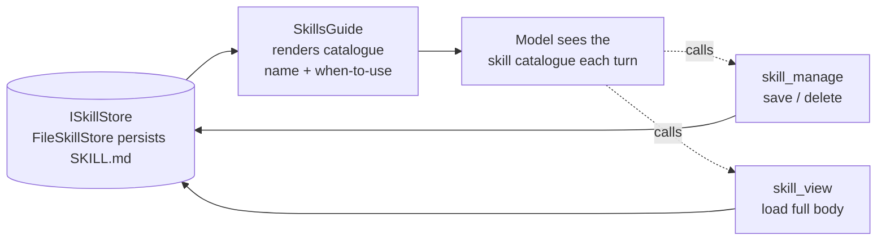
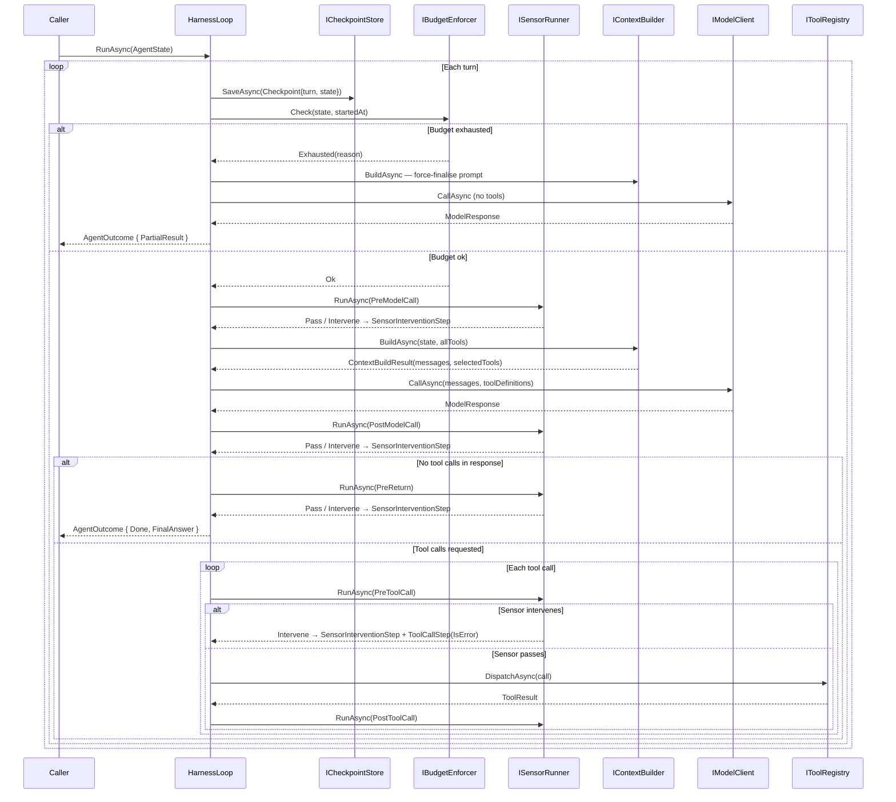

# model-harness

A reusable model harness framework for .NET 10, structured around Clean / Onion
architecture.

> **Why "model harness"?** An *Agent* = Model + Harness. The harness
> is the scaffolding (loop, guides, sensors, budget) that wraps a model and
> turns it into an agent.

The samples under `samples/` wire up `ClaudeModelClient` against the Anthropic API
and `OllamaModelClient` against a local Ollama instance. A `FakeModelClient` is also
provided for local development with no external dependencies.

## Run it

Each scenario is its own console project under `samples/`. Add your Anthropic API
key to the `appsettings.local.json` of the sample you want to run, e.g.
`samples/HappyPath/appsettings.local.json`:

```json
{
  "Anthropic": {
    "ApiKey": "sk-ant-..."
  }
}
```

To run the Ollama scenario, add the Ollama model you want to use (the model
must be pulled locally with `ollama pull <model>`) to
`samples/OllamaToolCall/appsettings.local.json`:

```json
{
  "Ollama": { "ModelId": "qwen2.5:7b" }
}
```

Then run any sample by its project path:

```bash
dotnet run --project samples/HappyPath
dotnet run --project samples/OllamaToolCall
```

JSON trace events stream to stdout, followed by the final outcome and a
flattened trajectory.

---

## Core patterns

The framework is built around two composable patterns that together give
fine-grained control over agent behaviour without modifying the loop.

### The Guide pattern — shaping perception

A **Guide** controls what the model sees on each turn. Before every model call,
all registered guides run in order, each contributing to a shared `ContextDraft`.
`DefaultContextBuilder` then assembles the draft into the final prompt.

```mermaid
flowchart LR
    A([All registered tools]) --> D

    subgraph "Guide pipeline — runs before every model call"
        direction LR
        D[ContextDraft\ninitialised] --> G1[SystemPromptGuide\nsets SystemPrompt]
        G1 --> G2[HarnessInstructionsGuide\nappends harness conventions]
        G2 --> G3[TrajectoryGuide\nrenders history]
        G3 --> G4[MemoryGuide\nsurfaces snippets]
        G4 --> G5[ToolSelectorGuide\nfilters AvailableTools]
        G5 --> G6[ToolCatalogueGuide\nrenders tool catalogue]
        G6 --> G7[SkillsGuide\nrenders skill catalogue]
        G7 --> GN[... custom guides]
    end

    GN --> CB[DefaultContextBuilder\nassembles prompt]
    CB --> M([Model call])
```



Each guide receives the full `ContextDraft` and the current `AgentState`, and
writes into one or more of the draft's fields:

| Field | Purpose |
|---|---|
| `SystemPrompt` | Agent identity and standing instructions |
| `TrajectoryMessages` | Rendered history — model turns, tool results, sensor notes |
| `MemorySnippets` | Long-term knowledge surfaced from a retrieval system |
| `AvailableTools` | Tool list for this turn — guides can filter or reorder |
| `SystemSections` | Pre-rendered system-prompt sections (tool catalogue, skill catalogue) appended after the prompt |

Implement `IGuide` to create a custom guide:

```csharp
public sealed class MyGuide : IGuide
{
    public string Name => "my-guide";

    public Task ContributeAsync(ContextDraft draft, AgentState state, CancellationToken ct)
    {
        // e.g. filter tools based on the current turn count
        if (state.Trajectory.Count > 4)
            draft.AvailableTools.RemoveAll(t => t.Name == "search");

        return Task.CompletedTask;
    }
}
```

Register it in the builder:

```csharp
services.AddModelHarness(builder => builder.WithGuide<MyGuide>());
```

Guides run **sequentially** so each one can build on what the previous added —
a tool-selector guide can, for example, inspect memory snippets before deciding
which tools to expose.

### The Sensor pattern — observing and intervening

A **Sensor** observes the loop at declared hookpoints and can raise a concern
by returning `SensorResult.Intervene(reason)`. The loop's response to that concern
depends on the hookpoint — sensors do not control flow directly. Sensors run in
**parallel** at each hookpoint — they observe independently and do not share state.


The five hookpoints, their typical use, and what the loop does when a sensor intervenes:

| HookPoint | Fires | Typical use | On intervention |
|---|---|---|---|
| `PreModelCall` | Before building context and calling the model | Rate limiting, cost throttling | **The loop force-finalises** — it makes one model call with tools disabled so the model can answer from what it already knows, then returns `Done`. The loop cannot loop back here: no model call has happened yet, so the trajectory is unchanged from the previous turn — looping would be infinite. |
| `PostModelCall` | After the model responds, before acting on it | PII detection, output filtering | **Loops back** — the model gets another turn. Crucially, the flagged response text is **suppressed from the next context**: `TrajectoryGuide` omits it so the model cannot re-see flagged content. The intervention note still appears so the model knows why it was flagged. |
| `PreToolCall` | Before each tool is dispatched | Policy enforcement, authorisation | **Tool is never dispatched** — a `ToolCallStep` with `IsError = true` is recorded so the model sees a clean error result and can replan. |
| `PostToolCall` | After each tool result is received | Result validation, audit logging | **Advisory only** — the tool has already run and its result is already in the trajectory. The intervention is recorded as a system note; the model can still reason on the result. Use `PreToolCall` if you need to prevent execution. |
| `PreReturn` | Before returning a final answer to the caller | Answer quality checks | **Loops back** — the model retries. Unlike PostModelCall, the prior answer *is* visible in context so the model can see what it said and correct it. |

An intervention does not terminate the run. The sensor's reason is wrapped in a
`SensorInterventionStep` and appended to the trajectory. On the next turn,
`TrajectoryGuide` renders it as a system-role note prefixed `[HARNESS OBSERVATION — ...]`.
`HarnessInstructionsGuide` tells the model upfront (in the system prompt) what these
notes mean and that they must be treated as directives — this is the feedforward complement
to the sensor's feedback. Intervention records are separate from tool-call history so
tool history stays clean.

Implement `ISensor` to create a custom sensor:

```csharp
public sealed class MySensor : ISensor
{
    public string Name => "my-sensor";
    public IReadOnlySet<HookPoint> HookPoints { get; } =
        new HashSet<HookPoint> { HookPoint.PreToolCall };

    public Task<SensorResult> CheckAsync(
        HookPoint hookPoint, AgentState state, Step? triggeringStep, CancellationToken ct)
    {
        if (triggeringStep is ToolCallStep tc && tc.Call.ToolName == "dangerous-tool")
            return Task.FromResult(SensorResult.Intervene("dangerous-tool is not permitted."));

        return Task.FromResult(SensorResult.Pass);
    }
}
```

Register it in the builder:

```csharp
services.AddModelHarness(builder => builder.WithSensor<MySensor>());
```

### How guides and sensors work together

Sensors intervene; guides determine what the model learns from that intervention.
The loop itself stays unaware of either pattern's semantics — it just runs the
runners and records the steps.

```
Sensor intervenes at PreToolCall
        │
        ▼
SensorInterventionStep appended to AgentState.Trajectory
        │
        ▼  (next turn)
TrajectoryGuide renders it as a system-role note in ContextDraft
        │
        ▼
Model sees: "[HARNESS OBSERVATION — my-sensor at PreToolCall] dangerous-tool is not permitted — adjust your next action and do not repeat flagged behaviour."
        │
        ▼
Model re-plans without that tool
```

---

## Skills — procedural memory (getting better over time) - Experimental 

A **skill** is a write-up of how to do something, saved after the agent works it out
once so it can reuse it next time instead of figuring it out again. The agent builds
up a small library of these over time. Nothing about the model itself changes — the
only thing that changes is what we show it.

Skills reuse the two patterns above: a **guide** shows the model which skills exist,
and a **tool** lets the model save and load them. The harness just facilitates — the
loop (`HarnessLoop`) doesn't even know skills exist.



How it works, in one turn:

1. `SkillsGuide` shows the model a short list of saved skills — just the name and
   when to use each one (cheap, so it can sit in every prompt).
2. If the model wants one, it calls `skill_view` to read the full write-up.
3. When there's something worth keeping, the model calls `skill_manage` to save it.

`FileSkillStore` writes each skill to a `SKILL.md` file on disk, so skills stick
around between runs.

```csharp
// The read side ships on by default (no-op until a store is plugged in).
// Opt into the write side and a real store:
services
    .AddFileSkillStore("~/.skills")  // persists SKILL.md files
    .AddSkillTools();                // registers skill_manage + skill_view
```

See `samples/SkillLearning` for a runnable, no-API-key demo: run 1 saves a skill, and
run 2 loads it from disk and reuses it.

### Why it's built this way

The guiding rule: the harness handles **one task** (one "episode"); getting better
over many tasks is a separate job that lives *on top of* the harness, not inside it.
Every choice below keeps that learning logic out of the framework.

| Decision | Why |
|---|---|
| **Skills are notes, not code** | A skill is just text we drop into the prompt — not a new function that gets installed into the running agent. Nothing in the loop has to change, and a bad skill can't break anything — it's only text. |
| **The model decides to save — the harness just facilitates** | Remember *agent = model + harness*: it's the **model** that chooses to call `skill_manage`, and the harness simply dispatches the call and writes the file. The loop never forces a save or decides one is due. If you later want to automate that (e.g. save after a success), that's a layer you add on top — not something baked into the framework. |
| **On by default, but free until used** | The read side is always wired in, but the default store is empty — so the guide shows nothing and costs nothing until you plug in a real store. The tools and a real store are opt-in, like `AskHumanTool`. |
| **Show a short list, load on demand** | Every prompt carries only the skill names and when-to-use lines (cheap). The full write-up loads only when the model asks for it, so cost stays low even with lots of skills. |
| **Its own store, separate from memory** | Skills (named, with a body) are a different shape from memory snippets, so they get their own `ISkillStore` and the two can change independently. |

In short: **the harness stores, lists, and hands skills to the model. It never decides
when to save one, or whether the agent is "improving"** — the model makes that call.
Building anything smarter on top (like automatically saving after a success — see the
roadmap) is a layer you add, not part of the framework.

---

## The loop (`HarnessLoop`)



Budget exhaustion is not an exception — `IBudgetEnforcer.Check` returns
`Exhausted(reason)` and the loop makes one final model call with tools disabled,
returning `AgentOutcome { Status = PartialResult }`. `BudgetExceededException`
is reserved for tools or sub-agents that violate budget from underneath the loop.

---

## Extending the framework

### The three layers

The framework is layered so you can take exactly as much as you need.

**Layer 1 — Framework** (`AddModelHarness`): pure abstractions and no-op defaults.
The harness runs without any infrastructure packages — tools, sensors, a model, and a
tracer can all be wired in via the builder callback.

**Layer 2 — Infrastructure packages**: each package adds `With*` extension methods on
`ModelHarnessBuilder`. Install only the packages you need; each one is independent.

**Layer 3 — Opinionated defaults** (optional): a thin wrapper like `AddStandardModelHarness`
can pre-wire common choices (e.g. `InMemoryToolRegistry`, `StuckDetector`, and OpenTelemetry
tracing) so application code only has to supply what differs. This layer isn't shipped by
the framework — add it in your own app or platform layer when you find yourself repeating
the same builder calls across projects.

### Minimal setup

`AddModelHarness` is the single entry point. Pass a configuration callback that receives a
`ModelHarnessBuilder`, then resolve `Agent` and run:

```csharp
var services = new ServiceCollection();

services.AddModelHarness(builder => builder
    .WithSystemPrompt("You are a helpful assistant.")
    .WithConsoleTracer()
    .WithOtelTracer()
    .WithToolRegistry<InMemoryToolRegistry>()
    .WithTool<CalculatorTool>()
    .WithResilientModel(_ => new ClaudeModelClient(new ClaudeClientOptions { ApiKey = apiKey })));

await using var provider = services.BuildServiceProvider();

var outcome = await provider.GetRequiredService<Agent>()
    .RunAsync("What is 6 times 7?");

Console.WriteLine(outcome.FinalAnswer);
```

Everything below is opt-in.

### Add a tool

```csharp
public sealed class MyTool : ITool
{
    public string Name => "my-tool";
    public string Description => "Does something useful.";
    public JsonElement InputSchema => JsonDocument.Parse("""{ "type": "object" }""").RootElement;

    public Task<ToolResult> ExecuteAsync(ToolCall call, ToolContext ctx, CancellationToken ct)
        => Task.FromResult(new ToolResult(call.CallId, "result"));
}
```

Register it in the builder:

```csharp
builder.WithTool<MyTool>()
```

For tools that call external services (HTTP APIs, databases, A2A sub-agents), add Polly
retry + circuit-breaking via the Resilience package:

```csharp
builder.WithResilientTool<MyApiTool>()
```

### Expose MCP tools

Add a reference to the [ModelContextProtocol NuGet package](https://www.nuget.org/packages/ModelContextProtocol), create an `McpClient` for your server, then wrap each `McpClientTool` in a thin `ITool` adapter:

```csharp
public sealed class McpTool(McpClient client, McpClientTool mcpTool) : ITool
{
    public string Name => mcpTool.Name;
    public string Description => mcpTool.Description ?? string.Empty;
    public JsonElement InputSchema => mcpTool.JsonSchema;

    public async Task<ToolResult> ExecuteAsync(ToolCall call, ToolContext ctx, CancellationToken ct)
    {
        var args = call.Arguments.EnumerateObject()
            .ToDictionary(p => p.Name, p => (object?)p.Value);
        var result = await client.CallToolAsync(mcpTool.Name, args, cancellationToken: ct);
        var text = string.Join("\n", result.Content.OfType<TextContentBlock>().Select(b => b.Text));
        return new ToolResult(call.CallId, string.IsNullOrEmpty(text) ? "(no text content)" : text, IsError: result.IsError == true);
    }
}
```

Enumerate the server's tools and register them:

```csharp
var mcpTools = await mcpClient.ListToolsAsync();
foreach (var t in mcpTools)
    builder.WithTool(_ => new McpTool(mcpClient, t));
```

### Add a sensor

```csharp
builder.WithSensor<MySensor>()
```

`DefaultSensorRunner` picks it up automatically and runs it in parallel with other sensors
at the same hookpoint. See the sensor pattern section above for how to implement `ISensor`.

### Add a guide

```csharp
builder.WithGuide<MyGuide>() // runs after the seven built-in guides
```

See the guide pattern section above for how to implement `IGuide`.

### Tracers

Tracers are additive — call `WithTracer` (or its convenience variants) multiple times and
they are automatically composed into a `CompositeTracer` at resolution time:

```csharp
builder
    .WithConsoleTracer()   // human-readable stdout — handy for local dev
    .WithOtelTracer()      // OpenTelemetry spans + metrics — handy for production
```

Implement `ITracer` and register via `WithTracer<T>()` or `WithTracer(factory)` for a
custom backend.

### Checkpoint / resume

```csharp
builder.WithFileCheckpointStore("/var/checkpoints")
```

The loop saves a checkpoint at the start of each turn. To resume after a crash:

```csharp
var store = provider.GetRequiredService<ICheckpointStore>();
var latest = await store.LoadLatestAsync(taskId, ct);

var outcome = await provider.GetRequiredService<Agent>()
    .RunAsync(latest!.State with { Status = AgentStatus.Running });
```

Implement `ICheckpointStore` to target blob storage, a database, or any other backend.

### Human-in-the-loop

```csharp
// Development — blocks on stdin
builder.WithAskHumanTool<ConsoleHumanChannel>()

// Production — implement IHumanChannel for your delivery mechanism
builder.WithAskHumanTool(_ => new SlackHumanChannel(slackClient, channelId))
```

When the model calls `ask_human`, the harness routes it through `IHumanChannel.AskAsync`
and feeds the response back. See the harness concerns section for where this boundary sits.

### Skills (procedural memory)

```csharp
builder
    .WithFileSkillStore("~/.skills")
    .WithSkillTools()
```

`SkillsGuide` already runs by default — it just shows nothing until a store is plugged in.
See the skills section above for how this works end-to-end.

### Swap the model client

```csharp
// Anthropic (via Infrastructure.Anthropic)
builder.WithResilientModel(_ => new ClaudeModelClient(new ClaudeClientOptions
{
    ApiKey = apiKey,
    ModelId = "claude-haiku-4-5-20251001"
}))

// Ollama — local inference (via Infrastructure.Ollama)
builder.WithOllamaModel(new OllamaClientOptions { ModelId = "qwen2.5:7b" })
```

For resilience (Polly retry + circuit-breaker), use `WithResilientModel` from the
Resilience package. Pass a custom `ResiliencePipeline<ModelResponse>` as a second
argument to override the default policy.

---

## Harness concerns vs. user concerns

Understanding what the framework owns and what it deliberately leaves to the user is key to extending it correctly.

### Harness concerns — the framework owns these

These are things every agent needs, regardless of domain. The framework provides them and they are always present.

| Concern | Where it lives | Status |
| ------- | -------------- | ------ |
| Turn-by-turn loop orchestration | `HarnessLoop` | ✅ |
| Budget enforcement (turns, tokens, cost, wall clock) | `IBudgetEnforcer` / `DefaultBudgetEnforcer` | ✅ |
| Context assembly — what the model sees each turn | Guide pipeline / `IContextBuilder` | ✅ |
| Trajectory rendering and compaction | `TrajectoryGuide` | ✅ |
| Sensor observation and intervention routing | `ISensorRunner` / hookpoints | ✅ |
| Tool dispatch | `IToolRegistry` | ✅ |
| Procedural-memory plumbing — listing, loading & persisting skills | `SkillsGuide` / `ISkillStore` / `skill_manage` + `skill_view` | ✅ |
| Human-in-the-loop plumbing — signalling a question & dispatching to a channel | `AskHumanTool` / `IHumanChannel` | ✅ |
| Model transport | `IModelClient` | ✅ |
| Tracing and metrics | `ITracer` / `CompositeTracer` | ✅ |
| Checkpoint / resume | `ICheckpointStore` / `FileCheckpointStore` | ✅ |

Infrastructure projects ship concrete implementations of these seams. They are conveniences — a user could write their own — but they are implementations of harness-level abstractions and belong in this repo.

### User concerns — the framework does not own these

These are things that vary by agent, deployment, or domain. The framework provides the seam; the user provides the implementation.

| Concern | Seam | Notes |
| ------- | ---- | ----- |
| Sub-agents / A2A | `ITool` | A local sub-agent is an `ITool` whose `ExecuteAsync` runs another `HarnessLoop`. A remote one calls an A2A endpoint. The framework has no opinion on which — it just dispatches the tool call. |
| Long-term memory | `IMemoryStore` → `MemoryGuide` | Replace `NullMemoryStore` with a vector store or knowledge graph. |
| Procedural memory / skills | `ISkillStore` → `SkillsGuide` + `skill_manage` / `skill_view` | Replace `NullSkillStore` with `FileSkillStore` or a custom backend. The harness surfaces, loads, and persists skills; the **model** decides *when* to save one (the harness just dispatches the call). Any cross-episode automation on top is the user's. |
| Tool relevance ranking | `IToolSelector` → `ToolSelectorGuide` | Filter or rerank `ContextDraft.AvailableTools` per turn. |
| Domain sensors | `ISensor` | Business rules, authorisation checks, output quality gates — all per-agent. |
| Domain tools | `ITool` | Everything the model can invoke. |
| Human-in-the-loop | `IHumanChannel` → `AskHumanTool` | The harness provides the seam and a `ConsoleHumanChannel` for development. How a question is surfaced — stdin, Slack, webhook, queue — is a system design decision the harness cannot make. See the FAQ. |

---

## Glossary

| Term | Definition |
|---|---|
| **Agent** | An Agent = Model + Harness. A loop-driven process that takes a natural-language task, uses tools and a model to produce a result, and records every step it takes. |
| **Harness** | The scaffolding that wraps a model: loop, guides, sensors, and budget. The harness is a model control concern — it does not own application or system design decisions. |
| **Turn** | One iteration of the loop: build context → call model → act on response. Each turn appends one or more `Step`s to the trajectory. |
| **Episode** | One full run of the agent on a single task — from the first turn to the final `AgentOutcome`. An episode is usually several turns. "Across episodes" means across many separate runs (e.g. reusing a skill saved in an earlier run). |
| **Trajectory** | The append-only, ordered list of `Step`s on `AgentState`. It is the durable log of everything the agent has done and seen. Three step types: `ModelCallStep` (a model call and its response), `ToolCallStep` (a tool invocation and its result), `SensorInterventionStep` (a sensor concern and its reason). |
| **AgentState** | Immutable record of the agent's full state at a point in time. New state is produced each turn — the trajectory is the log of those transitions. |
| **AgentOutcome** | The terminal result of a run: final answer, status (`Done`, `PartialResult`, `Failed`), and the last `AgentState`. |
| **Budget** | Hard limits on a run: `MaxTurns`, `MaxContextTokens`, `MaxCostUsd`, `MaxWallClock`. Checked at the top of every turn before any sensor or model call. |
| **Guide** | Shapes what the model perceives. Guides run sequentially before each model call, each contributing to a shared context draft — system prompt, trajectory, memory snippets, available tools. |
| **Sensor** | Observes the loop at declared hookpoints and can raise a concern. Sensors run in parallel; the loop's response to a concern depends on the hookpoint (see the hookpoint table). |
| **HookPoint** | A lifecycle position where sensors fire: `PreModelCall`, `PostModelCall`, `PreToolCall`, `PostToolCall`, `PreReturn`. |
| **Tool** | Something the model can invoke by name. The harness dispatches the call; the model decides when and why to use it. |
| **Skill** | A reusable procedure (procedural memory) the agent captures from past work and reuses later. Stored as data (a `SKILL.md` document) and surfaced into the prompt by `SkillsGuide`, never executed as code. Created by the model via `skill_manage`; loaded on demand via `skill_view`. |
| **Model client** | The transport seam (`IModelClient`). Receives a message list and tool definitions; returns a response. Knows nothing about state, the loop, or tool implementations. |
| **Checkpoint** | A durable snapshot of `AgentState` saved at the start of each turn. Used to resume a run after a crash or restart — pass the loaded state back to a fresh `HarnessLoop`. |

---

## Links

- [ROADMAP.md](ROADMAP.md) — what's done and what's still to implement
- [FAQ.md](FAQ.md) — design decision FAQs
