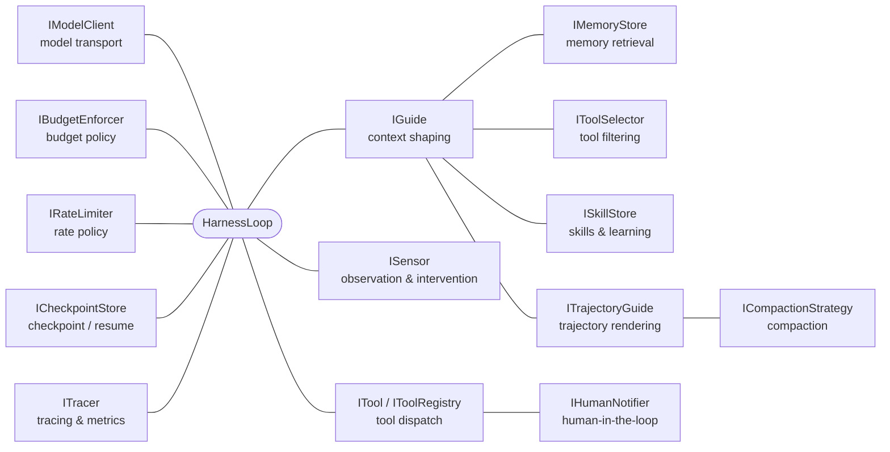
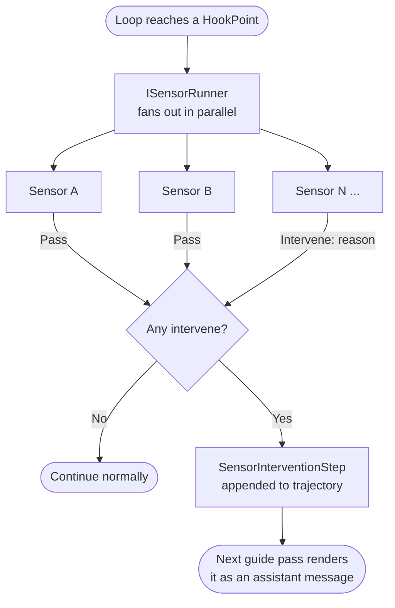
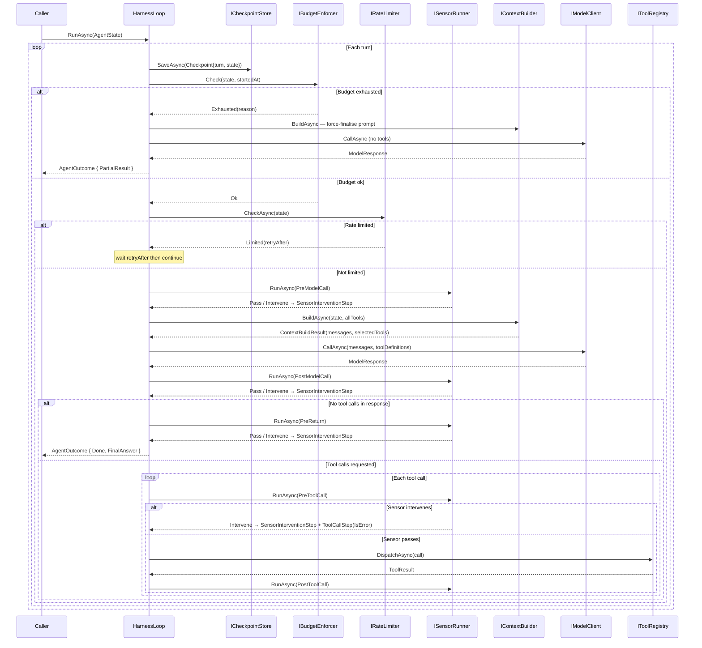

# Model Harness

**A ports-and-adapters agent framework for .NET 8 and .NET 10.** An agent is a *model + harness* — model-harness is the harness: the loop, guides, sensors, and budget that turn a raw model into a controllable agent. Every moving part is a port with a working default, so you can wire the standard agent in a few lines or replace any single piece without touching the loop.

[](https://www.nuget.org/packages/SapphireGuard.ModelHarness)
[](https://github.com/AnilKerai/model-harness/actions/workflows/ci.yml)
[](LICENSE)


*I wrote this to learn how agentic systems work by building one, and to teach my team with it.
Corrections and criticism are genuinely welcome — [more below](#where-this-came-from).*

## Why model-harness

**Do more with less.** The prevailing assumption is that a better agent needs a bigger frontier model. This framework tests the opposite: a well-structured harness closes much of that gap — enough that a smaller, cheaper, or locally-hosted model can run the same task at *acceptable* quality. The practical ambition is to swap `ClaudeModelClient` for `OllamaModelClient` on a 7B local model and still get a usable result, at a fraction of the cost. Where that bar sits is a product decision, not a model decision.

The harness gets there by making every control point a swappable port with a sensible default:

- **Everything is an extension point.** Context shaping, safety checks, budget, rate limiting, memory, compaction, tracing, checkpointing, and model transport are each a named port you replace via the builder — no loop changes. [→ extension points](#extension-points)
- **Two patterns, total control.** [Guides](#the-guide-pattern--shaping-perception) shape what the model sees each turn; [sensors](#the-sensor-pattern--observing-and-intervening) observe and intervene at five hookpoints. Most features are built purely from these two.
- **Bounded by construction.** Turns, tokens, cost, and wall-clock are [hard limits](#budget-enforcement) checked every turn; exhaustion returns a partial result, never an exception.
- **Batteries included.** Prompt-injection defense, PII redaction, loop/stuck detection, taint tracking, skills/learning, incremental compaction, sub-agents, and human-in-the-loop ship in the box. [→ what's included](#batteries-included)
- **Bring any model.** Anthropic, Azure OpenAI / AI Foundry, and Ollama adapters ship today; `IModelClient` is the port for anything else.
- **Production-minded.** OpenTelemetry GenAI spans + metrics, checkpoint/resume, circuit-breaker resilience, and prompt caching are wired or one call away.

---

## Quickstart

`AddStandardModelHarness` is the recommended entry point — supply a model, your tools, and any overrides:

```csharp
var services = new ServiceCollection();

services.AddStandardModelHarness(builder => builder
    .WithSystemPrompt("You are a helpful assistant.")
    .WithConsoleTracer()
    .WithTool<CalculatorTool>()
    .WithClaudeModel(new ClaudeClientOptions { ApiKey = apiKey }));

await using var provider = services.BuildServiceProvider();

var outcome = await provider.GetRequiredService<Agent>()
    .RunAsync("What is 6 times 7?");

Console.WriteLine(outcome.FinalAnswer);
```

No API key? Samples fall back to a `FakeModelClient`, so the harness runs without one. A minimal runnable project is in [`getting-started/`](getting-started/) — open `GettingStarted.slnx`, drop an `appsettings.local.json` with your key, and run. Then: **[RUNNING.md](docs/RUNNING.md)** to run the samples, **[EXTENDING.md](docs/EXTENDING.md)** for how-to recipes, **[PRIMER.md](docs/PRIMER.md)** for the ideas behind it.

---

## Extension points

Every part of the harness is a port you replace via the builder — but be clear-eyed about what ships: many ports default to a deliberate **no-op**, several have a **real** default that works out of the box, and a couple you **supply** yourself. The map, then the three groups:



### Works out of the box — real defaults

A real implementation runs unless you override it.

| Port | Default | What it does |
|---|---|---|
| `IBudgetEnforcer` | `DefaultBudgetEnforcer` | Enforces turn / token / cost / wall-clock limits at the top of each turn; returns `PartialResult` on exhaustion rather than throwing. |
| `IContextBuilder` | `DefaultContextBuilder` | Assembles the final prompt from the `ContextDraft` guides produce. |
| `ITrajectoryGuide` | `HeadEvictionTrajectoryGuide` | Renders turn history into the context window, evicting the oldest steps when the budget is tight. Always runs last. |
| `IToolSelector` | `PassthroughToolSelector` | Filters which tools the model sees each turn — all of them, by default. |
| `IToolRegistry` | `InMemoryToolRegistry` *(standard)* | Holds and dispatches tools. Bare `AddModelHarness` starts empty with `NullToolRegistry`. |
| `ITracer` | `OpenTelemetryTracer` *(standard)* | Nested `gen_ai.*` spans + metrics; per-turn events for sensors, guides, compaction, checkpoints, rate-limit waits, and budget burn-down. Bare uses `NullTracer`; add `WithConsoleTracer()` / `WithOtelTracer()`. |

### No-op until you opt in

A null default does nothing until you wire a real one — free until used.

| Port | Default | Opt in with |
|---|---|---|
| `IMemoryStore` | `NullMemoryStore` | a vector store or knowledge graph for retrieval-augmented context, queried by the latest user turn. |
| `ISkillStore` | `NullSkillStore` | `WithSkills` / `WithLearning` — `SKILL.md` procedures the agent reads and writes. |
| `ICompactionStrategy` | `NullCompactionStrategy` | `WithAiCompaction(...)` — fold a rolling summary instead of the bare omission note. |
| `ICheckpointStore` | `NullCheckpointStore` | `FileCheckpointStore` — save `AgentState` each turn and resume after a crash. |
| `IRateLimiter` | `NullRateLimiter` | a provider sliding-window limiter checked before each model call. |
| `IHumanNotifier` | `NullHumanNotifier` | a channel that delivers `ask_human` questions and suspends the run with `AwaitingHuman`. |

### You supply

No default — the harness needs these from you. The last three are **additive**: what you register runs alongside the built-ins.

| Port | Default | What it is |
|---|---|---|
| `IModelClient` | none — **required** | Model transport. Supply via a provider convenience method (`.WithClaudeModel(...)` / `.WithOllamaModel(...)` / `.WithAzureOpenAIModel(...)`), the generic `.WithModel(...)`, or `.WithResilientModel(...)` for a production circuit breaker. |
| `ITool` | none | Domain tools — the only way the agent acts on the world. |
| `ISensor` | `StuckDetector`, `ProgressCheckSensor`, `PromptInjectionSensor` *(standard)* | Observe and intervene at the five hookpoints; bare wires none. |
| `IGuide` | the seven built-in guides | Shape what the model sees each turn; custom guides slot in before the trajectory guide. |

Beyond the ports: a tool can pin reference content (`ToolResult.Pins`) into the non-evictable region so it survives compaction, and any `ITool` can wrap a nested `HarnessLoop` as a fully-isolated sub-agent — see [EXTENDING.md](docs/EXTENDING.md).

---

## Core patterns

The framework is built around two composable patterns that together give
fine-grained control over agent behaviour without modifying the loop. The agentic-AI theory behind them is written up in [PRIMER.md](docs/PRIMER.md).

### The Guide pattern — shaping perception

A **Guide** controls what the model sees on each turn. Before every model call,
all registered guides run in order, each contributing to a shared `ContextDraft`.
`DefaultContextBuilder` then assembles the draft into the final prompt.

```mermaid
flowchart LR
    A([All registered tools]) --> D

    subgraph "Guide pipeline — runs before every model call"
        direction LR
        D[ContextDraft\ninitialised] --> G1[HarnessInstructionsGuide\nappends harness conventions]
        G1 --> GR[ReActGuide\nprimes reason + act]
        GR --> G2[MemoryGuide\nsurfaces snippets]
        G2 --> G3[ToolSelectorGuide\nfilters AvailableTools]
        G3 --> G4[ToolCatalogueGuide\nrenders tool catalogue]
        G4 --> G5[SkillsGuide\nrenders skill catalogue]
        G5 --> GN[... custom guides]
        GN --> G6[TrajectoryGuide\nrenders history — always last]
    end

    G6 --> CB[DefaultContextBuilder\nassembles prompt]
    CB --> M([Model call])
```



Each guide receives the full `ContextDraft` and the current `AgentState`, and
writes into one or more of the draft's fields:

| Field | Purpose |
|---|---|
| `SystemPrompt` | Agent identity and standing instructions |
| `TrajectoryMessages` | Rendered history — model turns, tool results, sensor notes |
| `MemorySnippets` | Long-term knowledge surfaced from a retrieval system, queried by the latest user turn |
| `AvailableTools` | Tool list for this turn — guides can filter or reorder |
| `SystemSections` | Pre-rendered system-prompt sections (tool catalogue, skill catalogue) appended after the prompt |

Every field is an explicit choice about what the model sees on this turn — the `ContextDraft` is the harness's concrete representation of a context engineering decision. Implement `IGuide` to change any of those choices without touching the loop.

See [EXTENDING.md](docs/EXTENDING.md) for the `IGuide` interface and registration. The pipeline order is explicit and fixed. Two ordering constraints drive it:

- **`ToolSelectorGuide` before `ToolCatalogueGuide`** — the catalogue renders whatever tools the selector has approved for this turn; reversing them would always render the full tool list regardless of filtering.
- **`HeadEvictionTrajectoryGuide` last** — it measures the token cost of everything already written to `ContextDraft` (`SystemPrompt`, `MemorySnippets`, `SystemSections`) to compute how much context window remains for the trajectory. Running earlier would mean guessing at that cost with a fixed reserve. This constraint is enforced structurally: `HeadEvictionTrajectoryGuide` implements `ITrajectoryGuide` (not `IGuide`), and `DefaultGuideRunner` resolves it as a separate dependency and always invokes it after all `IGuide` instances — no reliance on DI registration order. Swap the default via `builder.WithTrajectoryGuide<T>()`.

Custom guides registered via `builder.WithGuide<T>()` slot in after the built-ins and before `HeadEvictionTrajectoryGuide`.

The standing system prompt that guides like `HarnessInstructionsGuide` and `ReActGuide` append to is itself set by a `SystemPromptGuide`, added when you call `builder.WithSystemPrompt(...)`. It is registered by that builder call rather than by the default pipeline, so it is not one of the always-on built-in guides. Because every guide contributes to one shared `SystemPrompt`, the order among the prompt-appending guides does not matter.

`ReActGuide` implements the [ReAct](https://arxiv.org/abs/2210.03629) pattern: it primes the model to interleave reasoning (a one-line *Thought*) with actions (tool calls) and *Observations* on each result. The act/observe half is already the loop — the model emits tool calls, the harness dispatches them and feeds results back — so this guide is the system-prompt nudge that makes the reasoning explicit and inspectable.

Complementing it, `HeadEvictionTrajectoryGuide` re-injects the original task text as a `[ORIGINAL GOAL]` system note on every turn so the model cannot drift from its starting intent, even after trajectory compaction drops early history.

### The Sensor pattern — observing and intervening

A **Sensor** observes the loop at declared hookpoints and can raise a concern
by returning `SensorResult.Intervene(reason)`. The loop's response to that concern
depends on the hookpoint — sensors do not control flow directly. Sensors run in
**parallel** at each hookpoint — they observe independently and do not share state.



The five hookpoints, their typical use, and what the loop does when a sensor intervenes:

| HookPoint | Fires | Typical use | On intervention |
|---|---|---|---|
| `PreModelCall` | Before building context and calling the model | Goal-drift warnings, error-streak alerts, conditional pre-reasoning guidance | **Annotates** — the note is appended to the trajectory and the model call proceeds on the same turn so the model can act on it immediately. Rate limiting belongs in `IRateLimiter`; hard cost limits belong in `IBudgetEnforcer`. Neither belongs here. |
| `PostModelCall` | After the model responds, before acting on it | PII detection, output filtering | **Rejects** — the response is suppressed from the trajectory so the model cannot re-see flagged content; the model gets a fresh turn to produce a clean response. |
| `PreToolCall` | Before each tool is dispatched | Policy enforcement, authorisation | **Blocks** — the tool is never dispatched; a `ToolCallStep` with `IsError = true` is recorded so the model sees a clean error and can replan. |
| `PostToolCall` | After each tool result is received | Result validation, audit logging | **Flags** — advisory only; the tool has already run and its result is in the trajectory. The intervention is recorded as an assistant message; the model can still reason on the result. Use `PreToolCall` if you need to prevent execution. |
| `PreReturn` | Before returning a final answer to the caller | Answer quality checks | **Challenges** — the answer is not accepted; the model gets a fresh turn with its prior response visible so it can see what it said and self-correct. |

Sensors may block actions but must never take turns away from the model — the model
always gets the next call so it can self-correct. Each hookpoint has a precise verb:
annotate (`PreModelCall`), reject (`PostModelCall`), block (`PreToolCall`), flag
(`PostToolCall`), challenge (`PreReturn`). An intervention wraps the sensor's reason
in a `SensorInterventionStep` and appends it to the trajectory. On the next turn
(or the same turn for `PreModelCall`), `HeadEvictionTrajectoryGuide` renders it as an assistant-role message
prefixed `[HARNESS OBSERVATION — ...]`. `HarnessInstructionsGuide` tells the model upfront
(in the system prompt) what these notes mean and that they must be treated as directives —
this is the feedforward complement to the sensor's feedback. Intervention records are
separate from tool-call history so tool history stays clean.

See [EXTENDING.md](docs/EXTENDING.md) for the `ISensor` interface and registration.

### How guides and sensors work together

Sensors intervene; guides determine what the model learns from that intervention.
The loop itself stays unaware of either pattern's semantics — it just runs the
runners and records the steps.

```
Sensor intervenes at PreToolCall
        │
        ▼
SensorInterventionStep appended to AgentState.Trajectory
        │
        ▼  (next turn)
TrajectoryGuide renders it as an assistant-role message in ContextDraft
        │
        ▼
Model sees: "[HARNESS OBSERVATION — my-sensor at PreToolCall] My previous response was blocked: dangerous-tool is not permitted. I will comply fully and not repeat this behaviour."
        │
        ▼
Model re-plans without that tool
```

---

## The loop (`HarnessLoop`)



Budget exhaustion is not an exception — `IBudgetEnforcer.Check` returns
`Exhausted(reason)` and the loop makes one final model call with tools disabled,
returning `AgentOutcome { Status = PartialResult }`. `BudgetExceededException`
is reserved for tools or sub-agents that violate budget from underneath the loop.

---

## Budget enforcement

Every run is bounded by a `Budget` — four hard limits checked at the top of each turn
before any sensor or model call:

| Limit | What it controls |
|---|---|
| `MaxTurns` | Maximum number of loop iterations |
| `MaxTotalTokens` | Cumulative token ceiling across the whole run (all model, tool, sensor, and compaction calls). Not the per-turn context window — that's `CompactionOptions.WindowTokens`. |
| `MaxCost` | Maximum spend (based on the model client's cost tracking) |
| `MaxWallClock` | Maximum elapsed time from the first turn |

Budget exhaustion is **not an exception** — it is control flow. When a limit is hit,
the loop makes one final model call with tools disabled so the model can produce a
best-effort answer from what it already knows, then returns
`AgentOutcome { Status = PartialResult }`. This keeps the agent composable — callers
always get a result, never an unhandled exception from the harness itself.

```csharp
var outcome = await agent.RunAsync(task, budget: new Budget
{
    MaxTurns       = 10,
    MaxTotalTokens = 100_000,
    MaxCost        = 0.50m,
    MaxWallClock   = TimeSpan.FromMinutes(2)
});

if (outcome.Status == AgentStatus.PartialResult)
    // The agent hit a limit — outcome.FinalAnswer is its best-effort response.
```

Implement `IBudgetEnforcer` and register via `builder.WithBudgetEnforcer<T>()` to replace
the default policy — useful for dynamic limits, per-user quotas, or cost allocation.

---

## Batteries included

Most of these are built from the two patterns above — a guide, a sensor, or a tool — and each is opt-in. The three experimental ones have full write-ups in **[FEATURES.md](docs/FEATURES.md)**; wiring for everything is in **[EXTENDING.md](docs/EXTENDING.md)**.

**Safety & loop control** (sensors)
- `PromptInjectionSensor` — scans tool results and user turns for injection patterns (on by default)
- `PiiRedactionSensor` — rejects responses that leak PII and forces a clean retry
- `StuckDetector`, `MonologueLoopSensor`, `AlternatingToolLoopSensor`, `ToolErrorLoopSensor` — catch the no-progress and looping failure modes
- `ProgressCheckSensor` (task-completion nudge), `ToolResultSanityCheckSensor` (implausible output), `CriticSensor` (quality challenge at `PreReturn`)
- **[AI-powered sensors](docs/FEATURES.md#ai-powered-sensors-experimental)** — delegate a nuanced check (tone, policy) to a small model, budgeted against the run
- **[Taint tracking](docs/FEATURES.md#prompt-injection-and-taint-tracking-experimental)** — block privileged actions once untrusted content is in the trajectory

**Memory & learning**
- **[Agent learning / skills](docs/FEATURES.md#agent-learning-experimental)** — the agent writes and reloads its own `SKILL.md` procedures across runs
- `IMemoryStore` — retrieval-augmented context, queried by the latest user turn
- Incremental **compaction** — folds a rolling summary as history is evicted, so cost stays flat

**Models & production**
- Model adapters: **Anthropic**, **Azure OpenAI / AI Foundry**, and **Ollama** (local inference) — plus prompt caching and circuit-breaker resilience
- **OpenTelemetry** GenAI spans + metrics, **checkpoint/resume**, **human-in-the-loop** (async suspend/resume), and **sub-agents** (each with its own model, sensors, and budget)

---

## Architecture & setup

### The three layers

The framework is structured in three layers. This is also the pattern we recommend if you
build a platform or shared agent library on top of it.

**Layer 1 — Ports and core loop** (`Framework`): the loop, all port interfaces, and no-op
defaults. Zero infrastructure dependencies — the harness runs with whatever adapters you wire
in. This is the stable core everything else builds on.

**Layer 2 — Common adapters** (the `Infrastructure.*` packages): ready-made implementations
of the framework ports — model clients, tracing, persistence, resilience, and so on.
Consumers pick the packages they need; each is independent. If a built-in adapter doesn't fit,
replace it by implementing the port directly.

**Layer 3 — Standard agent** (`AddStandardModelHarness` in `Infrastructure`): pre-wires the
common adapters into a sensible out-of-the-box experience. Engineering consumers who don't
want to make every wiring decision can call this and just supply a model, their tools, and any
overrides. Defaults are applied first; anything you add layers on top.

### What's wired by default

Both `AddModelHarness` (core, in `Framework`) and `AddStandardModelHarness` (in
`Infrastructure`) register the same **framework defaults**: the core loop and `Agent`, the
full guide pipeline (`HarnessInstructionsGuide → ReActGuide → MemoryGuide → ToolSelectorGuide →
ToolCatalogueGuide → SkillsGuide → PinnedContextGuide`, with `HeadEvictionTrajectoryGuide` always last),
`DefaultBudgetEnforcer`, the default context builder / guide runner / sensor runner, and a no-op
for every remaining port (`NullMemoryStore`, `NullSkillStore`, `PassthroughToolSelector`,
`NullCompactionStrategy`, `NullCheckpointStore`, `NullRateLimiter`, `NullHumanNotifier`).
**Neither registers a model client** — you always supply one in the `configure` callback: a provider
convenience method like `.WithClaudeModel(...)`, the generic `.WithModel(...)`, or `.WithResilientModel(...)` (adds a production circuit breaker).

`AddStandardModelHarness` then layers the opinionated extras on top:

| Seam | `AddModelHarness` (bare) | `AddStandardModelHarness` adds |
|---|---|---|
| Tool registry | `NullToolRegistry` (empty) | `InMemoryToolRegistry` |
| Built-in tools | none | `GetDateTimeTool` |
| Sensors | none | `StuckDetector`, `ProgressCheckSensor`, `PromptInjectionSensor` |
| Tracing | `NullTracer` | `OpenTelemetryTracer` |

Port defaults use `TryAdd`, so a matching `.WithX(...)` in your callback replaces them; tools,
sensors, and guides are additive, so the ones you add run alongside the built-ins. Everything
beyond the standard set is opt-in and wired explicitly — `CriticSensor`, the loop detectors
(`MonologueLoopSensor`, `AlternatingToolLoopSensor`, `ToolErrorLoopSensor`),
`TaintTrackingSensor`, `AiCompactionStrategy`, HITL, and checkpoint/resume — see
[EXTENDING.md](docs/EXTENDING.md).

### Packages

Each layer ships as an independent NuGet package — take only what you need:

```
dotnet add package SapphireGuard.ModelHarness           # core loop + port interfaces
dotnet add package SapphireGuard.ModelHarness.Infrastructure  # sensors, tracing, DI wiring
dotnet add package SapphireGuard.ModelHarness.Anthropic  # Claude adapter
dotnet add package SapphireGuard.ModelHarness.AzureOpenAI # Azure AI Foundry / Azure OpenAI adapter
dotnet add package SapphireGuard.ModelHarness.Ollama     # Ollama adapter (local inference)
dotnet add package SapphireGuard.ModelHarness.Resilience # Polly retry + circuit breaker
dotnet add package SapphireGuard.ModelHarness.Persistence # checkpoint / resume
```

A runnable getting-started project is in [`getting-started/`](getting-started/) — open
`GettingStarted.slnx`, drop an `appsettings.local.json` with your API key, and run.

### Conversational agents

The entry points above run a task to a terminal state. For a **multi-turn chat agent** — one that
stays open across many user turns — use `AddChatHarness` (bare, in `Framework`) or
`AddStandardChatHarness` (opinionated, in `Infrastructure`). Same loop, state, and `Agent`; they
just swap two seams for the conversational lifecycle: a **per-turn budget**
(`TurnScopedBudgetEnforcer`, so each user turn gets a fresh allowance instead of the whole
conversation draining one budget) and an **unpinned goal** (the trajectory guide stops re-injecting
the first message as `[ORIGINAL GOAL]`, since a conversation's live goal is the latest turn).
`AddStandardChatHarness` also wires the chat-appropriate sensors — `PromptInjectionSensor` and
`StuckDetector` — but not the task-completion `ProgressCheckSensor`.

Carry the conversation forward by passing the prior outcome's state back with `WithUserMessage`:

```csharp
services.AddStandardChatHarness(builder => builder
    .WithSystemPrompt("You are a friendly assistant.")
    .WithClaudeModel(new ClaudeClientOptions { ApiKey = apiKey }));

await using var provider = services.BuildServiceProvider();
var agent = provider.GetRequiredService<Agent>();
var time = provider.GetRequiredService<TimeProvider>();

AgentOutcome? outcome = null;
while (Console.ReadLine() is { Length: > 0 } input)
{
    var state = outcome is null
        ? AgentState.NewTask(input, budget, time.GetUtcNow())          // first turn
        : outcome.FinalState.WithUserMessage(input, time.GetUtcNow()); // continue the conversation
    outcome = await agent.RunAsync(state);
    Console.WriteLine(outcome.FinalAnswer);
}
```

See `samples/Conversation` (bare chat REPL) and `samples/ChatSubAgent` (chat agent that delegates
to a sub-agent specialist).

---

## Where this came from

I built this to learn how agentic systems actually work — not by reading about the loop, but by
implementing it — and then to have something concrete to teach my team with. That's why every
control point is a named port, and why [PRIMER.md](docs/PRIMER.md) explains the ideas rather than
just the API: the framework and the explanation were written together.

It's public because the learning goes further with other people in it. If something here is wrong,
missing, or a decision you'd have made differently, please
[open an issue](https://github.com/AnilKerai/model-harness/issues) — I'd rather hear it than not,
and the blunt kind is the most useful. [CONTRIBUTING.md](CONTRIBUTING.md) covers sending a change.

---

## Links

- [getting-started/](getting-started/) — minimal runnable project using the published NuGet packages
- [RUNNING.md](docs/RUNNING.md) — setup and run instructions for each sample
- [EXTENDING.md](docs/EXTENDING.md) — code recipes for every extension point
- [FEATURES.md](docs/FEATURES.md) — deep write-ups for the experimental features (learning, AI sensors, taint tracking)
- [PRIMER.md](docs/PRIMER.md) — a primer on the agentic-AI ideas behind the framework: the agentic primitives, context engineering, and loop engineering
- [GLOSSARY.md](docs/GLOSSARY.md) — definitions of all framework terms
- [ROADMAP.md](docs/ROADMAP.md) — what's done and what's still to implement
- [FAQ.md](docs/FAQ.md) — design decision FAQs

