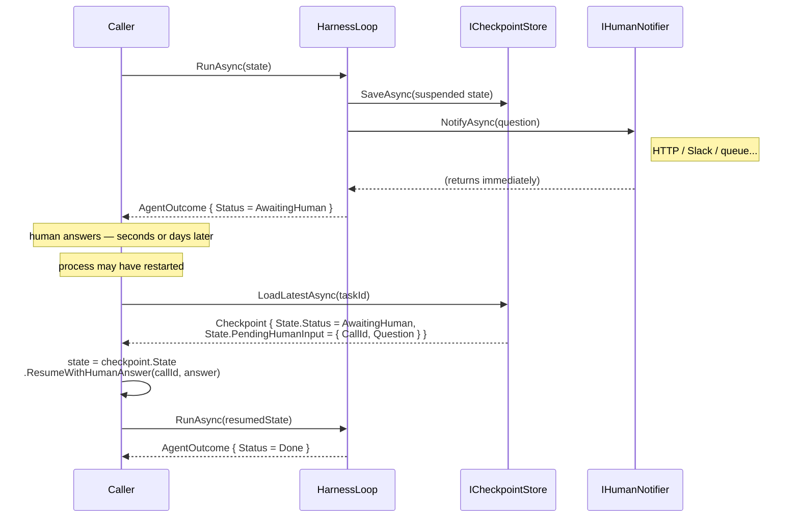

# Extending the framework

Code recipes for implementing and registering each extension point. Start with the [extension points map](../README.md#extension-points) to understand what exists before choosing what to implement.

## Customising the harness

Use `AddModelHarness` directly when you want full control over every registered component —
it is the lower-level entry point that `AddStandardModelHarness` builds on:

```csharp
services.AddModelHarness(builder => builder
    .WithSystemPrompt("You are a helpful assistant.")
    .WithConsoleTracer()
    .WithOtelTracer()
    .WithToolRegistry<InMemoryToolRegistry>()
    .WithTool<CalculatorTool>()
    .WithSensor<MySensor>()
    .WithGuide<MyGuide>()
    .WithClaudeModel(new ClaudeClientOptions { ApiKey = apiKey }));
```

Everything below is opt-in whether you use `AddStandardModelHarness` or `AddModelHarness`.

## Conversational (chat) agents

`AddModelHarness` / `AddStandardModelHarness` run a task to a terminal state — they are built for
"do this, return a result". A **chat agent** has a different lifecycle: it stays open across many
user turns, each with its own goal. Use `AddChatHarness` (bare, `Framework`) or
`AddStandardChatHarness` (opinionated, `Infrastructure`) for that shape.

```csharp
services.AddStandardChatHarness(builder => builder
    .WithSystemPrompt("You are a friendly assistant.")
    .WithClaudeModel(new ClaudeClientOptions { ApiKey = apiKey }));
```

These are thin siblings of the model-harness entry points — same `HarnessLoop`, `AgentState`, and
`Agent` — that swap two seams for the conversational lifecycle:

- **Per-turn budget** (`TurnScopedBudgetEnforcer`): counts turns/cost/tokens since the last
  `UserMessageStep`, so every user turn gets a fresh allowance. The default `DefaultBudgetEnforcer`
  sums the whole trajectory, which would exhaust a long chat after `MaxTurns` total model calls.
- **Unpinned goal** (`HeadEvictionTrajectoryGuide(pinOriginalGoal: false)`): drops the
  `[ORIGINAL GOAL]` anchor, since a conversation's live goal is the latest user turn, not the opener.

`AddStandardChatHarness` additionally wires the chat-appropriate standard defaults —
`InMemoryToolRegistry`, `GetDateTimeTool`, OpenTelemetry tracing, and the `PromptInjectionSensor`
+ `StuckDetector` security/loop sensors. It deliberately omits the task-completion
`ProgressCheckSensor` (a conversation has no single goal to make progress toward). The bare
`AddChatHarness` wires no sensors or tools — it *can't*, since those live in `Infrastructure` — so
reach for it only when you want a minimal pure-chat loop and will wire your own.

Drive the conversation by carrying state forward with `WithUserMessage` — it re-opens the completed
run and appends the next user turn, so the model sees the whole history:

```csharp
var time = provider.GetRequiredService<TimeProvider>();
AgentOutcome? outcome = null;
while (Console.ReadLine() is { Length: > 0 } input)
{
    var state = outcome is null
        ? AgentState.NewTask(input, budget, time.GetUtcNow())          // first turn seeds the conversation
        : outcome.FinalState.WithUserMessage(input, time.GetUtcNow()); // subsequent turns continue it
    outcome = await agent.RunAsync(state);
    Console.WriteLine(outcome.FinalAnswer);
}
```

See `samples/Conversation` (bare REPL) and `samples/ChatSubAgent` (chat agent delegating to a
sub-agent specialist).

## Multi-agent setup

For multi-agent systems use `AddAgentFactory`. Each named agent gets its own isolated
sub-container — `AddStandardAgent` / `AddAgent` mirror the single-agent entry points and
share the same defaults source of truth. Use `AddSubAgentAsTool` to expose one agent as
a tool on another's builder:

```csharp
services.AddAgentFactory(factory =>
{
    factory.AddStandardAgent("research", builder => builder
        .WithSystemPrompt("You are a research specialist.")
        .WithModel(...));

    factory.AddStandardAgent("orchestrator", builder => builder
        .WithSystemPrompt("You are an orchestrator.")
        .WithModel(...)
        .AddSubAgentAsTool("research", factory));
});

await using var provider = services.BuildServiceProvider();
var outcome = await provider.GetRequiredService<AgentFactory>()
    .GetAgent("orchestrator")
    .RunAsync("Research quantum computing and write a brief summary.");
```

Each agent's sensors, model, and budget are fully isolated — nothing leaks between
sub-containers. See `samples/SubAgent` for a runnable no-API-key demo.

`AddSubAgentAsTool` takes an optional `Budget` to bound each delegated run — for example
`AddSubAgentAsTool("research", factory, new Budget { MaxTurns = 4, MaxCost = 0.10m, ... })`. Omit it
and the sub-agent uses the agent's default budget. The sub-agent's cost is returned through the tool
result and counted against the calling agent's budget, so delegation spend is accounted for; the
explicit budget is what bounds a single delegation from overrunning. `samples/ChatSubAgent` passes a
tight budget to its currency specialist.

## Add a tool

```csharp
public sealed class MyTool : ITool
{
    public string Name => "my-tool";
    public string Description => "Does something useful.";
    public JsonElement InputSchema => JsonDocument.Parse("""{ "type": "object" }""").RootElement;

    public Task<ToolResult> ExecuteAsync(ToolCall call, ToolContext ctx, CancellationToken ct)
        => Task.FromResult(new ToolResult(call.CallId, "result"));
}
```

Register it in the builder:

```csharp
builder.WithTool<MyTool>()
```

For tools that call external services (HTTP APIs, databases, A2A sub-agents), add Polly
retry + circuit-breaking via the Resilience package:

```csharp
builder.WithResilientTool<MyApiTool>()
```

### Large tool results

A `ToolResult.Content` is stored verbatim on an **append-only** trajectory and checkpointed with the
whole state every turn. `HeadEvictionTrajectoryGuide` keeps an oversized result out of the *prompt*
(it is evicted and compacted once it exceeds the window), but the step stays in the trajectory — so a
multi-megabyte result is re-serialised to disk on every remaining turn, and under AI compaction it is
fed to the summariser.

The harness deliberately **does not truncate** tool output: only the tool knows which bytes are
disposable, so bounding output is the tool's job. Three patterns, cheapest first:

**Paginate** — a `read_file` / `list_*` tool takes `offset` + `limit` and returns one page plus a hint:

```csharp
return new ToolResult(call.CallId,
    $"{pageText}\n\n[rows {offset}–{offset + count} of {total}; call again with offset={offset + count} for more]");
```

**Cap at the source** — a `sql_query` / `search` tool pushes a `LIMIT` down to the query and reports
what it dropped (`[top 50 of 4,200 matches — refine your filter]`), rather than materialising the whole
result set and trimming after.

**Summary + handle** — for a large fetch (a web page, a document), return a short summary and an id,
and expose a follow-up tool (`fetch_section(id, …)`) so the agent pulls only the slice it needs. This
keeps the full payload out of the trajectory entirely.

In each case the result carries a marker telling the model there is more and how to reach it, so the
model narrows its next call instead of drowning in one turn. If you need a blunt safety net against a
*misbehaving* tool (rather than routine trimming), the opt-in `ToolResultSanityCheckSensor` flags a
result over a character limit at `PostToolCall` — but it annotates, it does not shrink what was already
committed, so tool-side bounding is the real fix.

## Replace the tool registry

`IToolRegistry` is the port that sits between the loop and your tools. It has two jobs: supply the tool list to the guide pipeline each turn (`List()`), and route model-issued tool calls to the right implementation (`DispatchAsync()`).

The default `InMemoryToolRegistry` is a static collection — tools are registered at startup via `builder.WithTool<T>()` and the list never changes while the agent is running. That is fine for most agents, but there are two situations where you want to swap it:

**Dynamic tool sets** — the available tools depend on runtime state (the current user, a feature flag, a remote capability query). A custom registry can compute `List()` and resolve `Get()` dynamically on each call.

**Remote / MCP tooling** — rather than wrapping individual MCP tools as `ITool` instances at startup (see the next section), a registry-backed approach lets the agent discover tools from a remote server at runtime. This is more appropriate when the tool set is large, changes frequently, or is not fully known when the agent is composed.

Replace via the builder:

```csharp
builder.WithToolRegistry<MyToolRegistry>()
// or via factory:
builder.WithToolRegistry(_ => new MyToolRegistry(config))
```

Implement the interface:

```csharp
public sealed class MyToolRegistry : IToolRegistry
{
    public IReadOnlyList<ITool> List()
        // return whatever tools are available right now

    public ITool? Get(string name)
        // resolve by name — return null if not found

    public async Task<ToolResult> DispatchAsync(ToolCall call, ToolContext ctx, CancellationToken ct)
    {
        var tool = Get(call.ToolName);
        if (tool is null)
            return new ToolResult(call.CallId, $"Tool '{call.ToolName}' not found.", IsError: true);
        return await tool.ExecuteAsync(call, ctx, ct);
    }
}
```

`DispatchAsync` should return an error `ToolResult` for unknown tool names rather than throwing — the loop treats an error result as a clean signal the model can replan from.

## Expose MCP tools

This approach enumerates the MCP server's tools at startup and registers them statically. It is the right choice when the tool set is known upfront and does not change while the agent is running. If your MCP server's tools are dynamic or not fully known at composition time, replace the tool registry instead — see [Replace the tool registry](#replace-the-tool-registry) above.

Add a reference to the [ModelContextProtocol NuGet package](https://www.nuget.org/packages/ModelContextProtocol), create an `McpClient` for your server, then wrap each `McpClientTool` in a thin `ITool` adapter:

```csharp
public sealed class McpTool(McpClient client, McpClientTool mcpTool) : ITool
{
    public string Name => mcpTool.Name;
    public string Description => mcpTool.Description ?? string.Empty;
    public JsonElement InputSchema => mcpTool.JsonSchema;

    public async Task<ToolResult> ExecuteAsync(ToolCall call, ToolContext ctx, CancellationToken ct)
    {
        var args = call.Arguments.EnumerateObject()
            .ToDictionary(p => p.Name, p => (object?)p.Value);
        var result = await client.CallToolAsync(mcpTool.Name, args, cancellationToken: ct);
        var text = string.Join("\n", result.Content.OfType<TextContentBlock>().Select(b => b.Text));
        return new ToolResult(call.CallId, string.IsNullOrEmpty(text) ? "(no text content)" : text, IsError: result.IsError == true);
    }
}
```

Enumerate the server's tools and register them:

```csharp
var mcpTools = await mcpClient.ListToolsAsync();
foreach (var t in mcpTools)
    builder.WithTool(_ => new McpTool(mcpClient, t));
```

## Add a sensor

```csharp
builder.WithSensor<MySensor>()
```

`DefaultSensorRunner` picks it up automatically and runs it in parallel with other sensors
at the same hookpoint. See the [sensor pattern](../README.md#the-sensor-pattern--observing-and-intervening) for how to implement `ISensor`.

## Taint tracking *(Experimental)*

Taint tracking guards against prompt injection attacks that attempt to use external content to trigger privileged side-effecting actions. See the [Prompt injection and taint tracking](FEATURES.md#prompt-injection-and-taint-tracking-experimental) feature write-up for the threat model, and [PRIMER.md](PRIMER.md#prompt-injection-and-taint-tracking) for the theory.

**Wiring:**

```csharp
builder.WithTaintTracking(
    untrustedSources: ["fetch_webpage", "read_document", "query_database"],
    privilegedActions: ["send_email",   "execute_code",  "make_payment"]);
```

`untrustedSources` — tools whose results should be treated as potentially hostile external content. As a rule of thumb: any tool that reads content you do not control belongs here. MCP tools should be listed as untrusted sources unless you have explicitly verified and trust the server author.

`privilegedActions` — tools that have real-world side effects and must not run while tainted content is in the trajectory. If a tool can send data somewhere, modify state outside the agent, or execute arbitrary logic, it belongs here.

> ⚠️ **This sensor fails closed.**
>
> Once a result from an untrusted source enters the trajectory, **all** privileged actions are blocked for the remainder of that agent run — regardless of how many turns have passed or how unrelated the subsequent reasoning appears to be. The sensor has no way to determine whether the model's reasoning has been influenced by the tainted content, so it assumes the worst.
>
> **You must account for this in your agent design.** Concretely:
>
> - If your agent legitimately needs to fetch external content *and* take a privileged action in the same run, the blocked action will surface as a tool error. The model will replan — but it cannot complete the task without human intervention.
> - The intended escape hatch is `ask_human`: if `WithAskHumanTool` is configured, instruct the model in the system prompt to call it when a privileged action is blocked, so a human can review and authorise the action in context.
> - If no human channel is available, the model will return whatever partial answer it can — callers should be prepared to receive an incomplete result.

**System prompt guidance:**

Because the sensor blocks at the tool level but cannot force the model to escalate correctly, your system prompt should tell the model what to do when a block fires. For example:

```
If a privileged action is blocked by the harness, do not retry it.
If a human operator is available, call ask_human with full context
so they can review and authorise the action. Otherwise, return what
you have found so far and explain why you could not complete the task.
```

**Custom classification:**

`WithTaintTracking` registers a built-in `ITrustPolicy` that classifies tools by static membership of the two lists above. When classification needs more than static lists — it depends on runtime config, a server allow-list, or per-tool metadata — implement `ITrustPolicy` yourself and register it instead of calling `WithTaintTracking`:

```csharp
builder.Services.Replace(ServiceDescriptor.Singleton<ITrustPolicy>(new MyTrustPolicy(...)));
builder.WithSensor<TaintTrackingSensor>();
```

`TaintTrackingSensor` depends only on `ITrustPolicy`, so swapping the policy changes nothing else.

## Add a guide

```csharp
builder.WithGuide<MyGuide>() // runs after the built-in guides, before the trajectory guide
```

See the [guide pattern](../README.md#the-guide-pattern--shaping-perception) for how to implement `IGuide`.

## Structured output — a typed final answer

`WithStructuredOutput<T>()` constrains the run's **final answer** to `T`. It is a guide plus a sensor over one shared contract — no new port, no loop change:

```csharp
[Description("A triaged support ticket.")]
public sealed record TriageResult(
    [property: Description("The queue: billing, technical, or account.")] string Category,
    [property: Description("Urgency from 1 (lowest) to 5 (highest).")] int Priority,
    [property: Description("One sentence a human operator can act on.")] string Summary);

services.AddStandardModelHarness(builder => builder
    .WithClaudeModel(apiKey)
    .WithTool<LookupCustomerTool>()
    .WithStructuredOutput<TriageResult>());
```

Read the result through the same contract the sensor validated against, so the two cannot drift:

```csharp
var contract = serviceProvider.GetRequiredService<StructuredOutputContract<TriageResult>>();
var outcome = await agent.RunAsync(ticket);

if (contract.TryBind(outcome.FinalAnswer, out var triage, out var error))
    Console.WriteLine($"{triage!.Category} / P{triage.Priority}");
else
    Console.WriteLine($"No structured result: {error}");   // PartialResult — budget or intervention cap hit
```

`[Description]` flows into the JSON Schema the model is shown, so the fields document themselves. Non-object roots (`List<int>`, an enum) work as-is.

**What it does at runtime.** `StructuredOutputGuide<T>` states the schema as a *system section* every turn, and `StructuredOutputSensor<T>` runs at `PreReturn` — the only hookpoint the loop reaches on a turn with no tool calls, so the contract binds the final answer and leaves the tool-using turns alone. An answer that doesn't bind is challenged, not thrown: the binder's own error (naming the missing or malformed member) goes back to the model, which gets a fresh turn with tools suppressed so it can only reformat. The loop's intervention cap bounds the retries, ending in `PartialResult` rather than an exception. `TryBind` tolerates markdown code fences and prose around the payload, because weaker models emit both regardless of instruction.

**Two things to know.**

The schema lives in a system section, not the trajectory, so eviction can never reach it — that placement is deliberate, and it's why this needs no `Pins`. (Pins bridge *trajectory-borne* content, like a `skill_view` result, into the persistent region; a guide's contribution is already there.) It does count toward the eviction window, so a very large schema shrinks the room for episodic history.

If you supply your own `JsonSerializerOptions`, **keep `RespectRequiredConstructorParameters = true`**. Without it System.Text.Json treats every constructor parameter as optional — `Deserialize<TriageResult>("{}")` returns `TriageResult { Category = null, Priority = 0, Summary = null }` and does not throw — so the validation silently rubber-stamps an empty answer.

Runnable demo: `samples/StructuredOutput` (no API key needed).

## Replace the trajectory guide

The default `HeadEvictionTrajectoryGuide` evicts the oldest steps when the trajectory exceeds the context budget, replacing them with a placeholder via `ICompactionStrategy`. Swap it for a different eviction or rendering strategy via `builder.WithTrajectoryGuide<T>()`:

```csharp
public sealed class MyTrajectoryGuide(ICompactionStrategy compactionStrategy, CompactionOptions options) : ITrajectoryGuide
{
    public string Name => "my-trajectory";

    public async Task ContributeAsync(ContextDraft draft, AgentState state, CancellationToken ct)
    {
        // Write rendered steps into draft.TrajectoryMessages however you like.
        // draft.TrajectoryMessages is empty when this is called — write everything here.
        // Use options.WindowTokens (the per-turn context window) and state.Trajectory for inputs.
    }
}
```

Register it:

```csharp
builder.WithTrajectoryGuide<MyTrajectoryGuide>()
```

`ITrajectoryGuide` is kept separate from `IGuide` so `DefaultGuideRunner` can guarantee it always runs last — after all supporting guides have written to `ContextDraft` — without relying on DI registration order. Any implementation can structure `ContributeAsync` however it needs to; there is no shared base class forcing a particular eviction or compaction shape. `ICompactionStrategy` is available as a constructor dependency if the implementation evicts steps and wants to delegate the replacement text, but it is not required.

## Tracers

Tracers are additive — call `WithTracer` (or its convenience variants) multiple times and
they are automatically composed into a `CompositeTracer` at resolution time:

```csharp
builder
    .WithConsoleTracer()   // human-readable stdout — handy for local dev
    .WithOtelTracer()      // OpenTelemetry spans + metrics — handy for production
```

Implement `ITracer` and register via `WithTracer<T>()` or `WithTracer(factory)` for a
custom backend.

A tracer is notified at each loop milestone. Task start/completion and every sensor evaluation —
pass, intervention, or error alike — are one-shot events (`StartTrace`, `Complete`, `LogSensorResult`). **Model and tool calls are
scopes, not events**: the loop calls `BeginModelCall`/`BeginToolCall` *before* the operation and
gets back an `IModelCallScope`/`IToolCallScope`; when the call returns it calls `Complete(response)`
/`Complete(result)` on the scope, then disposes it. A scope disposed *without* `Complete` means
the call threw — record it as a failed span. This begin/complete shape is what lets a tracer
bracket a real span with an accurate duration: `OpenTelemetryTracer` emits a nested OpenTelemetry
GenAI span tree — an `invoke_agent` root with `chat {model}` and `execute_tool {name}` children
carrying `gen_ai.*` attributes, plus the `gen_ai.client.token.usage` and
`gen_ai.client.operation.duration` metrics. `CompositeTracer` fans one scope out to each
registered tracer's child scope, so native OTel and a debug tracer can run side by side.

A tracer also receives a `GuideContribution` after each guide runs — the structural delta that
guide made to the context draft: tools filtered out or added, memory snippets surfaced,
trajectory messages rendered, system-prompt sections added, and the system-prompt character
delta. Because the final prompt only shows what *survived* the pipeline, these per-guide deltas
are what let you reconstruct the decisions that shaped it — which tools a selector dropped, or
whether memory retrieval returned anything at all — which is often where an undesirable result
traces back to.

Every per-turn hook — `BeginModelCall`, `BeginToolCall`, `LogSensorResult`, `LogGuideContribution`,
`LogCompaction`, `LogRateLimit`, `LogCheckpoint`, `LogBudgetSnapshot` — takes a zero-based `turn` index so a backend can group everything that happened on
one turn. The loop **seeds** its turn counter from the trajectory (count of prior model calls) at
entry rather than from zero, then threads it into the model/tool/sensor hooks; the guide runner
derives the same index the same way. Seeding from the trajectory — not a run-local zero — is what
keeps turn numbering continuous across a resume: a HITL suspend/resume, checkpoint reload, or new
chat turn re-enters `RunAsync`, and a from-zero counter would restart the loop-emitted numbering
while the guide-derived index (read from the restored trajectory) kept counting. The guide runner
also fires `LogCompaction`
with a `CompactionTrace` (steps evicted, tokens reclaimed, folded, spend) whenever the trajectory
guide compacts — the telemetry for watching eviction on a long run. Three further per-turn hooks give
the loop full trace coverage: `LogRateLimit` (a rate-limit backoff wait), `LogCheckpoint` (each
checkpoint save and its duration), and `LogBudgetSnapshot` (cumulative turns/tokens/cost/wall-clock
against the run's `Budget`, so you can chart burn-down before the terminal `PartialResult`) — all
default-interface no-ops. `LogGuideContribution` and
`LogCompaction` remain default-interface no-ops, so a custom `ITracer` that never overrode them still compiles; but replacing the post-hoc
`LogModelCall`/`LogToolCall` with the `BeginModelCall`/`BeginToolCall` scope methods is a **breaking
change** — update your implementation when you upgrade. `ModelResponse` now also carries optional
`Model`/`Provider` fields (populated by the built-in adapters) that feed `gen_ai.request.model` and
`gen_ai.provider.name`.

### Exporting to a backend (Application Insights, OTLP)

`OpenTelemetryTracer` has **no OpenTelemetry SDK dependency** — it emits through the runtime's
`System.Diagnostics.ActivitySource` and `Meter`. Those are inert until the host attaches a listener
(the OTel SDK) **and** opts the harness's source/meter in by name. Miss this step and
`ActivitySource.StartActivity(...)` returns `null` on every call, so no spans are created and nothing
is exported — the harness looks silent even though tracing is "on". This is the single most common
reason traces never reach a backend.

Register the harness's source and meter by name — the names are public constants so they can't drift:

```csharp
using Azure.Monitor.OpenTelemetry.AspNetCore; // dotnet add package Azure.Monitor.OpenTelemetry.AspNetCore
using OpenTelemetry.Metrics;
using OpenTelemetry.Trace;
using SapphireGuard.ModelHarness.Infrastructure.Tracing;

builder.Services.AddOpenTelemetry().UseAzureMonitor(o =>
    o.ConnectionString = builder.Configuration["APPLICATIONINSIGHTS_CONNECTION_STRING"]);

// These two lines are what make the harness's telemetry flow into the exporter:
builder.Services.ConfigureOpenTelemetryTracerProvider((_, b) => b.AddSource(OpenTelemetryTracer.ActivitySourceName));
builder.Services.ConfigureOpenTelemetryMeterProvider((_, b) => b.AddMeter(OpenTelemetryTracer.MeterName));
```

For a vendor-neutral OTLP collector, swap the exporter and keep the same two `AddSource`/`AddMeter` lines:

```csharp
builder.Services.AddOpenTelemetry()
    .WithTracing(t => t.AddSource(OpenTelemetryTracer.ActivitySourceName).AddOtlpExporter())
    .WithMetrics(m => m.AddMeter(OpenTelemetryTracer.MeterName).AddOtlpExporter());
```

Two things to know once the traces arrive:

- **The agent run shows up as a *dependency*, not a *request*.** The `invoke_agent` root span is
  `ActivityKind.Internal`, and Application Insights maps `Internal`/`Client`/`Producer` spans to
  `dependencies` (only `Server`/`Consumer` become `requests`). Look under **Dependencies** (or the
  `dependencies` table in Logs), not **Requests**. When the agent runs inside an ASP.NET request the
  spans nest correctly under that request; a standalone worker has no parent request by design.
- **A short-lived console app can exit before telemetry is flushed.** The OTel batch exporter sends on
  a timer, so a process that runs the agent and returns immediately may drop the last batch. Dispose the
  provider (or call `TracerProvider.ForceFlush()` / `MeterProvider.ForceFlush()`) before exit — a
  `using`-scoped host or `await host.StopAsync()` handles this for you.

### Content capture and agent naming

`WithOtelTracer(enableSensitiveData, agentName)` takes two optional settings:

- **`enableSensitiveData`** (default `false`) — capture conversation *content*: `gen_ai.input.messages`
  / `gen_ai.output.messages` (prompt and response bodies) on each `chat` span, `gen_ai.tool.call.arguments`
  / `gen_ai.tool.call.result` on each `execute_tool` span, the task text on the root, and sensor-reason
  text on evaluation events. **Off by default** — no user or model content leaves the process unless you
  opt in. Turn it on in development to read the exchange; leave it off in production (and note that content
  attributes make spans larger, so ingestion cost rises when it's on). Error-path diagnostics — span
  status, the `exception` event, `harness.failure.reason` — are always emitted regardless, since they only
  appear when something already failed.
- **`agentName`** (default `null`) — stamped on the root span as `gen_ai.agent.name` and into its display
  name, so several agents in one process are told apart in the backend. For *which deployment* a trace
  came from, set `service.name` on the host resource instead; the source name itself is a fixed constant
  and is not meant to be reconfigured (it's the join key your `AddSource(...)` call matches).

```csharp
// enableSensitiveData off in production; a host env flag is a natural switch for it
builder.WithOtelTracer(enableSensitiveData: isDevelopment, agentName: "triage-agent");
```

## Checkpoint / resume and human-in-the-loop

These two features share the same underlying mechanism — `ICheckpointStore` — but serve
different purposes. There are three distinct use cases:

| Use case | API | When to use |
|---|---|---|
| Crash recovery only | `WithFileCheckpointStore(dir)` | Long-running tasks with no human involvement |
| HITL without durability | `WithAskHumanTool<TNotifier>()` | In-process demos, or when the caller manages state externally |
| HITL with durability *(most common)* | `WithHITL<TNotifier>(store)` | Production async human-in-the-loop |

### Crash recovery only

```csharp
builder.WithFileCheckpointStore("/var/checkpoints")
```

The loop saves a checkpoint at the start of each turn. To resume after a crash:

```csharp
var store = provider.GetRequiredService<ICheckpointStore>();
var latest = await store.LoadLatestAsync(taskId, ct);

var outcome = await provider.GetRequiredService<Agent>()
    .RunAsync(latest!.State with { Status = AgentStatus.Running });
```

`LoadLatestAsync` needs the `taskId`. By default `NewTask` generates one, so you must capture
and persist it yourself to resume later. To make the resume key something you already know,
supply your own — `agent.RunAsync(task, taskId: jobId)` or `AgentState.NewTask(task, budget, now,
taskId: jobId)` — so a job-queue ID, ticket number, or trace ID *is* the checkpoint key and no
ID-mapping table is needed. A caller-supplied ID owns its own uniqueness, and because
`FileCheckpointStore` uses it as a directory name it must be a single path segment (IDs containing
separators or `..` are rejected). The same ID also flows to the tracer and to tools via `ToolContext`.

Implement `ICheckpointStore` to target blob storage, a database, or any other backend.

### HITL without durability

Use `WithAskHumanTool` when the caller manages state externally (e.g. in an orchestrator
with its own persistence layer), or for in-process development demos where the original
process stays alive for the duration of the human wait:

```csharp
// Development — ConsoleHumanChannel prints the question; your loop reads stdin after RunAsync returns
builder.WithAskHumanTool<ConsoleHumanChannel>()

// Production — implement IHumanNotifier for your delivery mechanism, and manage state yourself
builder.WithAskHumanTool(_ => new SlackHumanNotifier(slackClient, channelId))
```

Without a checkpoint store, if the process dies while waiting for the human the run state
is lost. Use `WithHITL` below if that is not acceptable.

### HITL with durability *(most common)*

HITL is inherently cross-process — the human answers minutes or days later, long after the
original process may have exited. `WithHITL` registers the `ask_human` tool and a checkpoint
store together, making the coupling explicit:

```csharp
// Most common: file-backed checkpoint store
builder.WithHITL<SlackHumanNotifier>(new FileCheckpointStore("/var/checkpoints"))

// Generic form — when TStore is DI-resolvable with no constructor arguments
builder.WithHITL<SlackHumanNotifier, MyBlobCheckpointStore>()
```

When the model calls `ask_human`, the loop:
1. Builds a suspended state with `Status = AwaitingHuman` and `PendingHumanInput` set
2. Saves that state to the checkpoint store
3. Fires `IHumanNotifier.NotifyAsync` (fire-and-forget)
4. Returns `AgentOutcome { Status = AwaitingHuman }`

The checkpoint is self-describing — `State.PendingHumanInput` carries the call ID and
question, so a process that restarts can load the checkpoint and know exactly what to do
without needing the original `AgentOutcome` in memory.



**The suspend/resume cycle:**

```csharp
var outcome = await agent.RunAsync(task, budget);

while (outcome.Status == AgentStatus.AwaitingHuman)
{
    // FinalState.PendingHumanInput is the durable form — present whether you loaded
    // from a checkpoint or are continuing in-process after RunAsync returned.
    var pending = outcome.FinalState.PendingHumanInput!;
    var answer = await GetHumanAnswerAsync(pending.CallId);

    outcome = await agent.RunAsync(
        outcome.FinalState.ResumeWithHumanAnswer(pending.CallId, answer));
}
```

**Resuming after a crash:**

```csharp
var store = provider.GetRequiredService<ICheckpointStore>();
var checkpoint = await store.LoadLatestAsync(taskId, ct);

if (checkpoint?.State.Status == AgentStatus.AwaitingHuman)
{
    // Process restarted mid-wait — obtain the answer then resume
    var pending = checkpoint.State.PendingHumanInput!;
    var answer = await GetHumanAnswerAsync(pending.CallId);
    var state = checkpoint.State.ResumeWithHumanAnswer(pending.CallId, answer);
    outcome = await agent.RunAsync(state);
}
else if (checkpoint is not null)
{
    // Crash during a non-HITL turn — replay the interrupted turn
    outcome = await agent.RunAsync(checkpoint.State with { Status = AgentStatus.Running });
}
```

`ResumeWithHumanAnswer` replaces the pending `ToolCallStep` in the trajectory with the real
answer and clears `PendingHumanInput` — the model sees it as a normal completed tool call
on its next turn and continues from there.

See `samples/HitlSuspendResume` for a runnable in-process demo and `samples/CheckpointResume`
for crash-recovery checkpointing.

## Budget enforcement

```csharp
builder.WithBudgetEnforcer<MyBudgetEnforcer>()
```

Implement `IBudgetEnforcer` to replace the default policy with dynamic limits — per-user
quotas, cost allocation, or anything driven by runtime state. See the
[Budget enforcement](../README.md#budget-enforcement) section for how exhaustion works.

## Rate limiting

Provider APIs enforce sliding-window limits (calls per minute, tokens per minute) that vary
by account tier. The harness checks `IRateLimiter` before each model call and waits if the
limit is hit. By default no rate limiting is applied (`NullRateLimiter`).

Both built-in implementations inspect the trajectory's `ModelCallStep` timestamps — no
mutable state is needed in the limiter itself. Both reject a non-positive limit at construction,
and both treat the 60-second window's lower bound as **exclusive**, so a call turning exactly 60 s
old has aged out — which is what makes the reported `RetryAfter` land on the moment the limit
actually clears rather than one tick short of it.

```csharp
// Calls-per-minute cap — counts model calls in the last 60 s
builder.WithRateLimiter(_ => new CallsPerMinuteRateLimiter(callsPerMinute: 50))

// Tokens-per-minute cap — set this from your provider's input-tokens-per-minute (ITPM) limit
builder.WithRateLimiter(_ => new TokensPerMinuteRateLimiter(tokensPerMinute: 100_000))

// Both together — the harness automatically composes them and respects the most restrictive limit
builder
    .WithRateLimiter(_ => new CallsPerMinuteRateLimiter(callsPerMinute: 50))
    .WithRateLimiter(_ => new TokensPerMinuteRateLimiter(tokensPerMinute: 100_000))
```

### What counts toward the token limit

Billed tokens and rate-limited tokens are **not the same number** under prompt caching, and
`TokensPerMinuteRateLimiter` counts the latter. Anthropic excludes `cache_read_input_tokens`
from ITPM, so a cached prefix costs money and occupies context while consuming almost no
rate-limit budget — caching *raises* effective throughput rather than spending it. Counting
the billed prompt instead would throttle a well-cached agent several times too early, and get
worse the better the cache performed.

Each adapter declares its provider's accounting on `ModelResponse.InputTokensTowardRateLimit`
(`ClaudeModelClient` reports uncached input + cache writes). An adapter that leaves it null —
because its provider's rules aren't established — has the full prompt counted instead, which
throttles early rather than late. Set the ceiling from your **input** limit: input and output
are summed against it, and providers meter them separately, so the sum only ever errs toward
throttling sooner.

When a limit is hit the harness waits for the retry window, then continues. If the wait
would exceed `MaxWallClock` it triggers the budget-exhaustion path instead (one final
model call, `PartialResult`). Implement `IRateLimiter` and register via `WithRateLimiter`
for custom strategies (per-user quotas, burst allowances, etc.).

## Skills

Give an agent pre-authored `SKILL.md` instructions it can read but not modify — useful
for domain knowledge, standard operating procedures, or any fixed guidance you want
available across runs. Uses the [agentskills.io](https://agentskills.io) format.

```csharp
builder.WithSkills("~/.skills/builtin")
```

`SkillsGuide` surfaces the catalogue automatically; `skill_view` lets the model load
the full body on demand. No separate tool wiring needed.

## Learning

Enable the agent to accumulate its own skills over time. See the
[Agent Learning](FEATURES.md#agent-learning-experimental) section for the full explanation.

```csharp
builder.WithLearning("~/.skills/learned")
```

Chain both together to give the agent pre-authored skills *and* the ability to learn:

```csharp
builder
    .WithSkills("~/.skills/builtin")
    .WithLearning("~/.skills/learned")
```

## Swap the model client

```csharp
// Anthropic (via Infrastructure.Anthropic)
builder.WithClaudeModel(new ClaudeClientOptions
{
    ApiKey = apiKey,
    ModelId = "claude-haiku-4-5-20251001"
})

// Ollama — local inference (via Infrastructure.Ollama)
builder.WithOllamaModel(new OllamaClientOptions { ModelId = "qwen2.5:7b" })

// Azure AI Foundry / Azure OpenAI Service (via Infrastructure.AzureOpenAI)
// ApiKey = null uses DefaultAzureCredential (managed identity) — recommended for production
builder.WithAzureOpenAIModel(new AzureOpenAIClientOptions
{
    Endpoint = new Uri("https://your-resource.openai.azure.com"),
    DeploymentName = "gpt-4o",
    ApiKey = null
})
```

For a custom transport, implement `IModelClient` and register it with the generic `builder.WithModel(_ => new MyModelClient(...))`.

**Production resilience (opt-in).** `builder.WithResilientModel(...)` (from `Infrastructure.Resilience`) wraps any model client in a Polly **circuit breaker** — after a run of failures it fast-fails for a cooldown instead of hammering a down provider, which matters under high throughput or across a fleet. It deliberately adds *no* retry or timeout (the provider SDKs already own those — a stacked second retry caused compounding back-off), so a single agent run rarely needs it:

```csharp
builder.WithResilientModel(_ => new ClaudeModelClient(new ClaudeClientOptions { ApiKey = apiKey }))
```

The provider SDKs already retry transient failures and apply a request timeout — tune those via
the adapter's `ConfigureClient` hook (e.g. `ConfigureClient = o => o.Timeout = TimeSpan.FromMinutes(2)`
on `ClaudeClientOptions`, or `o => o.NetworkTimeout = ...` on `AzureOpenAIClientOptions`). Cap
per-call output length with `MaxOutputTokens` on any of the three options records — Anthropic
defaults to 8096 when unset (the API requires a value), Azure and Ollama fall back to the
service/model default. `ClaudeClientOptions` turns on Anthropic prompt caching by default
(`EnablePromptCaching`): the stable tool + system + prior-turn prefix is cached and re-read at
~0.1× input cost each turn — a win for the turn-by-turn loop; set it `false` for single-shot use
(Azure/OpenAI caches automatically server-side; Ollama is local). For an
additional circuit breaker that fast-fails during a sustained outage, wrap the client with
`WithResilientModel` from the Resilience package; pass a custom `ResiliencePipeline<ModelResponse>` as
a second argument to override the default breaker.

## Enable AI-powered compaction

By default, when the trajectory is trimmed to fit the context window, `HeadEvictionTrajectoryGuide` inserts a bare omission note (`[N earlier step(s) omitted — context window limit]`) and persists nothing — a stateless *view* that reconsiders the whole evicted head every turn. On long runs this loses signal the model may still need. `AiCompactionStrategy` replaces it with an incremental *fold*: it summarises only the newly evicted steps on top of the running summary and persists the result on `AgentState.RollingSummary`, so summarisation cost stays flat as the run grows instead of re-summarising the whole head each turn.

```csharp
builder.WithAiCompaction(
    new ClaudeModelClient(new ClaudeClientOptions
    {
        ApiKey = apiKey,
        ModelId = "claude-haiku-4-5-20251001"   // dedicated compaction model
    }),
    new CompactionOptions { WindowTokens = 150_000 })   // required: the eviction trigger
```

`CompactionOptions` is **required** when you opt into compaction, so a strategy is never wired without stating its trigger. `WindowTokens` is the per-turn context-window size the guide keeps each turn under by evicting — it is deliberately separate from `Budget.MaxTotalTokens`, which is the *cumulative* run-total token cap the enforcer checks. Set `WindowTokens` to your model's usable context window and `MaxTotalTokens` to however many tokens the whole run may consume; conflating them (the old single `MaxContextTokens`) hard-stopped compacted runs at ~one window. To tune the window without changing the strategy, use `WithCompactionOptions(...)`.

**Size `WindowTokens` to the task, not tight.** Below the window the trajectory guide does nothing, so a task that fits never compacts and pays zero cost or lossiness. Compaction trades fidelity for bounded context — it earns its keep only on long-horizon runs (deep research, multi-hour coding, long chat). A bounded task (e.g. a verification agent that loads a procedure, checks a few sources, and emits a report) should keep a generous window and leave compaction dormant; forcing a small window just pays the fidelity cost for no benefit.

The rolling summary is checkpointed, so a resumed run rehydrates it and folds onward rather than recomputing. The strategy's token usage and cost accumulate on `AgentState.CompactionUsage` / `CompactionCost` and are counted by the budget enforcer. It fails open — on model error or empty output the prior summary is preserved and a bare note is injected for the newly evicted slice (retried next turn), so a compaction failure never blocks the run. Use a fast, cheap model (Haiku-class).

### Write a custom compaction strategy

`ICompactionStrategy` is a framework extension point — implement it for structured clearing, semantic compression, or any policy of your own, and register it with `builder.WithCompactionStrategy<T>(options)` (the `CompactionOptions` are required here too). The harness calls it whenever the live context exceeds `WindowTokens`, handing it the **typed** steps being evicted (not pre-rendered text) plus the full run context:

```csharp
public sealed class MyCompactionStrategy : ICompactionStrategy
{
    public Task<CompactionResult> CompactAsync(CompactionRequest request, CancellationToken ct)
    {
        // request.EvictedSteps       — the typed steps being evicted this turn; branch on
        //                              ModelCallStep / ToolCallStep / SensorInterventionStep
        //                              to compact structurally rather than as opaque text
        // request.PriorSummary       — the summary accumulated so far (null on the first fold)
        // request.State              — full run context: task text, budget, whole trajectory
        // request.RemainingTokenBudget — approximate headroom the injected text should fit under

        var folded = (request.PriorSummary?.FoldedStepCount ?? 0) + request.EvictedSteps.Count;
        return Task.FromResult(new CompactionResult
        {
            InjectedText  = "…",                                  // rendered in place of the evicted steps
            UpdatedSummary = new RollingSummary("…", folded),     // null ⇒ stateless view; non-null ⇒ incremental fold
            // Usage / Cost — set these if you called a model; the budget counts them
        });
    }
}
```

Return `UpdatedSummary = null` to behave as a stateless view (the `NullCompactionStrategy` default); return a folded `RollingSummary` to compact incrementally. `CompactAsync` runs in the loop's hot path — it should not throw (the harness wraps it and falls back to an omission note) but must honour cancellation.

`samples/Compaction` is a runnable, no-API-key demo: it runs the same task with a narrating view strategy and a narrating fold strategy so you can watch, turn by turn, the view re-summarise the whole growing head while the fold only touches the newly evicted slice at a flat cost.

### Pin reference content so it survives compaction

Head-eviction drops the *oldest* trajectory steps first — but the oldest are often the most load-bearing (a loaded procedure, an output contract). If your agent loads such content via an early tool call and enforces it later, plain eviction will lose it. Pin it instead: a tool returns `PinnedNote { Label, Content }` on `ToolResult.Pins`, and the harness keeps it in the **non-evictable** system region.

```csharp
public Task<ToolResult> ExecuteAsync(ToolCall call, ToolContext ctx, CancellationToken ct)
{
    var spec = LoadSpec(call);
    return Task.FromResult(new ToolResult(
        call.CallId,
        "Loaded the API spec — it's now pinned in your context.",   // short ack, not the (evictable) body
        Pins: [new PinnedNote("API spec", spec)]));                  // the body, pinned to AgentState.Pins
}
```

The loop commits pins to `AgentState.Pins` (replacing any pin with the same `Label`), `PinnedContextGuide` renders them as system sections every turn, and they're checkpointed. The built-in `skill_view` uses exactly this, so a loaded skill body survives compaction while progressive disclosure (load on demand) is preserved. Pinned sections count toward the eviction window, so keep them focused — pin the contract, not a whole document.
