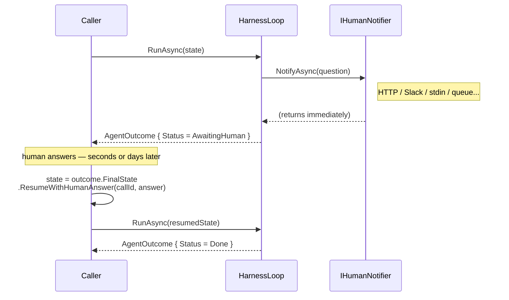

# Extending the framework

Code recipes for implementing and registering each extension point. Start with the [extension points map](../README.md#extension-points) to understand what exists before choosing what to implement.

## Customising the harness

Use `AddModelHarness` directly when you want full control over every registered component —
it is the lower-level entry point that `AddStandardModelHarness` builds on:

```csharp
services.AddModelHarness(builder => builder
    .WithSystemPrompt("You are a helpful assistant.")
    .WithConsoleTracer()
    .WithOtelTracer()
    .WithToolRegistry<InMemoryToolRegistry>()
    .WithTool<CalculatorTool>()
    .WithSensor<MySensor>()
    .WithGuide<MyGuide>()
    .WithResilientModel(_ => new ClaudeModelClient(new ClaudeClientOptions { ApiKey = apiKey })));
```

Everything below is opt-in whether you use `AddStandardModelHarness` or `AddModelHarness`.

## Multi-agent setup

For multi-agent systems use `AddAgentFactory`. Each named agent gets its own isolated
sub-container — `AddStandardAgent` / `AddAgent` mirror the single-agent entry points and
share the same defaults source of truth. Use `AddSubAgentAsTool` to expose one agent as
a tool on another's builder:

```csharp
services.AddAgentFactory(factory =>
{
    factory.AddStandardAgent("research", builder => builder
        .WithSystemPrompt("You are a research specialist.")
        .WithModel(...));

    factory.AddStandardAgent("orchestrator", builder => builder
        .WithSystemPrompt("You are an orchestrator.")
        .WithModel(...)
        .AddSubAgentAsTool("research", factory));
});

await using var provider = services.BuildServiceProvider();
var outcome = await provider.GetRequiredService<AgentFactory>()
    .GetAgent("orchestrator")
    .RunAsync("Research quantum computing and write a brief summary.");
```

Each agent's sensors, model, and budget are fully isolated — nothing leaks between
sub-containers. See `samples/SubAgent` for a runnable no-API-key demo.

## Add a tool

```csharp
public sealed class MyTool : ITool
{
    public string Name => "my-tool";
    public string Description => "Does something useful.";
    public JsonElement InputSchema => JsonDocument.Parse("""{ "type": "object" }""").RootElement;

    public Task<ToolResult> ExecuteAsync(ToolCall call, ToolContext ctx, CancellationToken ct)
        => Task.FromResult(new ToolResult(call.CallId, "result"));
}
```

Register it in the builder:

```csharp
builder.WithTool<MyTool>()
```

For tools that call external services (HTTP APIs, databases, A2A sub-agents), add Polly
retry + circuit-breaking via the Resilience package:

```csharp
builder.WithResilientTool<MyApiTool>()
```

## Expose MCP tools

Add a reference to the [ModelContextProtocol NuGet package](https://www.nuget.org/packages/ModelContextProtocol), create an `McpClient` for your server, then wrap each `McpClientTool` in a thin `ITool` adapter:

```csharp
public sealed class McpTool(McpClient client, McpClientTool mcpTool) : ITool
{
    public string Name => mcpTool.Name;
    public string Description => mcpTool.Description ?? string.Empty;
    public JsonElement InputSchema => mcpTool.JsonSchema;

    public async Task<ToolResult> ExecuteAsync(ToolCall call, ToolContext ctx, CancellationToken ct)
    {
        var args = call.Arguments.EnumerateObject()
            .ToDictionary(p => p.Name, p => (object?)p.Value);
        var result = await client.CallToolAsync(mcpTool.Name, args, cancellationToken: ct);
        var text = string.Join("\n", result.Content.OfType<TextContentBlock>().Select(b => b.Text));
        return new ToolResult(call.CallId, string.IsNullOrEmpty(text) ? "(no text content)" : text, IsError: result.IsError == true);
    }
}
```

Enumerate the server's tools and register them:

```csharp
var mcpTools = await mcpClient.ListToolsAsync();
foreach (var t in mcpTools)
    builder.WithTool(_ => new McpTool(mcpClient, t));
```

## Add a sensor

```csharp
builder.WithSensor<MySensor>()
```

`DefaultSensorRunner` picks it up automatically and runs it in parallel with other sensors
at the same hookpoint. See the [sensor pattern](../README.md#the-sensor-pattern--observing-and-intervening) for how to implement `ISensor`.

## Add a guide

```csharp
builder.WithGuide<MyGuide>() // runs after the seven built-in guides
```

See the [guide pattern](../README.md#the-guide-pattern--shaping-perception) for how to implement `IGuide`.

## Replace the trajectory guide

The default `HeadEvictionTrajectoryGuide` evicts the oldest steps when the trajectory exceeds the context budget, replacing them with a placeholder via `ICompactionStrategy`. Swap it for a different eviction or rendering strategy via `builder.WithTrajectoryGuide<T>()`:

```csharp
public sealed class MyTrajectoryGuide(ICompactionStrategy compactionStrategy) : ITrajectoryGuide
{
    public string Name => "my-trajectory";

    public async Task ContributeAsync(ContextDraft draft, AgentState state, CancellationToken ct)
    {
        // Write rendered steps into draft.TrajectoryMessages however you like.
        // draft.TrajectoryMessages is empty when this is called — write everything here.
        // Use state.Budget.MaxContextTokens and state.Trajectory for inputs.
    }
}
```

Register it:

```csharp
builder.WithTrajectoryGuide<MyTrajectoryGuide>()
```

`ITrajectoryGuide` is kept separate from `IGuide` so `DefaultGuideRunner` can guarantee it always runs last — after all supporting guides have written to `ContextDraft` — without relying on DI registration order. Any implementation can structure `ContributeAsync` however it needs to; there is no shared base class forcing a particular eviction or compaction shape. `ICompactionStrategy` is available as a constructor dependency if the implementation evicts steps and wants to delegate the replacement text, but it is not required.

## Tracers

Tracers are additive — call `WithTracer` (or its convenience variants) multiple times and
they are automatically composed into a `CompositeTracer` at resolution time:

```csharp
builder
    .WithConsoleTracer()   // human-readable stdout — handy for local dev
    .WithOtelTracer()      // OpenTelemetry spans + metrics — handy for production
```

Implement `ITracer` and register via `WithTracer<T>()` or `WithTracer(factory)` for a
custom backend.

## Checkpoint / resume

```csharp
builder.WithFileCheckpointStore("/var/checkpoints")
```

The loop saves a checkpoint at the start of each turn. To resume after a crash:

```csharp
var store = provider.GetRequiredService<ICheckpointStore>();
var latest = await store.LoadLatestAsync(taskId, ct);

var outcome = await provider.GetRequiredService<Agent>()
    .RunAsync(latest!.State with { Status = AgentStatus.Running });
```

Implement `ICheckpointStore` to target blob storage, a database, or any other backend.

## Human-in-the-loop

The harness uses a **suspend/resume** model rather than blocking for a human answer. When
the model calls `ask_human`, the loop fires the notifier, saves a checkpoint, and immediately
returns — the caller is free to wait however long the deployment requires before resuming.



**Wiring:**

```csharp
// Development — ConsoleHumanChannel prints the question; your loop reads stdin after RunAsync returns
builder.WithAskHumanTool<ConsoleHumanChannel>()

// Production — implement IHumanNotifier for your delivery mechanism
builder.WithAskHumanTool(_ => new SlackHumanNotifier(slackClient, channelId))
```

**The suspend/resume cycle:**

```csharp
var outcome = await agent.RunAsync(task, budget);

while (outcome.Status == AgentStatus.AwaitingHuman)
{
    var pending = outcome.PendingHumanInput!;
    // answer arrives via whatever mechanism IHumanNotifier dispatched to
    var answer = await GetHumanAnswerAsync(pending.CallId);

    var next = outcome.FinalState.ResumeWithHumanAnswer(pending.CallId, answer);
    outcome = await agent.RunAsync(next);
}
```

`ResumeWithHumanAnswer` replaces the pending `ToolCallStep` in the trajectory with the real
answer — the model sees it as a normal completed tool call on its next turn and continues from there.
`PendingHumanInput.CallId` is the correlation key that links the question to the answer across the
suspension boundary.

See `samples/HitlSuspendResume` for a runnable demo.

## Budget enforcement

```csharp
builder.WithBudgetEnforcer<MyBudgetEnforcer>()
```

Implement `IBudgetEnforcer` to replace the default policy with dynamic limits — per-user
quotas, cost allocation, or anything driven by runtime state. See the
[Budget enforcement](../README.md#budget-enforcement) section for how exhaustion works.

## Rate limiting

Provider APIs enforce sliding-window limits (calls per minute, tokens per minute) that vary
by account tier. The harness checks `IRateLimiter` before each model call and waits if the
limit is hit. By default no rate limiting is applied (`NullRateLimiter`).

Both built-in implementations inspect the trajectory's `ModelCallStep` timestamps — no
mutable state is needed in the limiter itself.

```csharp
// Calls-per-minute cap — counts model calls in the last 60 s
builder.WithRateLimiter(_ => new CallsPerMinuteRateLimiter(callsPerMinute: 50))

// Tokens-per-minute cap — sums input + output tokens in the last 60 s
builder.WithRateLimiter(_ => new TokensPerMinuteRateLimiter(tokensPerMinute: 100_000))

// Both together — the harness automatically composes them and respects the most restrictive limit
builder
    .WithRateLimiter(_ => new CallsPerMinuteRateLimiter(callsPerMinute: 50))
    .WithRateLimiter(_ => new TokensPerMinuteRateLimiter(tokensPerMinute: 100_000))
```

When a limit is hit the harness waits for the retry window, then continues. If the wait
would exceed `MaxWallClock` it triggers the budget-exhaustion path instead (one final
model call, `PartialResult`). Implement `IRateLimiter` and register via `WithRateLimiter`
for custom strategies (per-user quotas, burst allowances, etc.).

## Skills

Give an agent pre-authored `SKILL.md` instructions it can read but not modify — useful
for domain knowledge, standard operating procedures, or any fixed guidance you want
available across runs. Uses the [agentskills.io](https://agentskills.io) format.

```csharp
builder.WithSkills("~/.skills/builtin")
```

`SkillsGuide` surfaces the catalogue automatically; `skill_view` lets the model load
the full body on demand. No separate tool wiring needed.

## Learning

Enable the agent to accumulate its own skills over time. See the
[Agent Learning](../README.md#agent-learning-experimental) section for the full explanation.

```csharp
builder.WithLearning("~/.skills/learned")
```

Chain both together to give the agent pre-authored skills *and* the ability to learn:

```csharp
builder
    .WithSkills("~/.skills/builtin")
    .WithLearning("~/.skills/learned")
```

## Swap the model client

```csharp
// Anthropic (via Infrastructure.Anthropic)
builder.WithResilientModel(_ => new ClaudeModelClient(new ClaudeClientOptions
{
    ApiKey = apiKey,
    ModelId = "claude-haiku-4-5-20251001"
}))

// Ollama — local inference (via Infrastructure.Ollama)
builder.WithOllamaModel(new OllamaClientOptions { ModelId = "qwen2.5:7b" })

// Azure AI Foundry / Azure OpenAI Service (via Infrastructure.AzureOpenAI)
// ApiKey = null uses DefaultAzureCredential (managed identity) — recommended for production
builder.WithResilientModel(_ => new AzureOpenAIModelClient(new AzureOpenAIClientOptions
{
    Endpoint = new Uri("https://your-resource.openai.azure.com"),
    DeploymentName = "gpt-4o",
    ApiKey = null
}))
```

For resilience (Polly retry + circuit-breaker), use `WithResilientModel` from the
Resilience package. Pass a custom `ResiliencePipeline<ModelResponse>` as a second
argument to override the default policy.

## Enable AI-powered compaction

By default, when the trajectory is trimmed to fit the context window, `HeadEvictionTrajectoryGuide` inserts a bare omission note (`[N earlier step(s) omitted — context window limit]`). On long runs this loses signal the model may still need. `AiCompactionStrategy` replaces the note with a prose summary generated by a lightweight model:

```csharp
builder.WithAiCompaction(new ClaudeModelClient(new ClaudeClientOptions
{
    ApiKey = apiKey,
    ModelId = "claude-haiku-4-5-20251001"   // dedicated compaction model
}))
```

The strategy fails open — if the model call fails or returns empty text, the bare omission note is used instead, so a compaction failure never blocks the run. Use a fast, cheap model (Haiku-class); compaction calls are infrequent on well-scoped runs but could stack up on very long ones.
